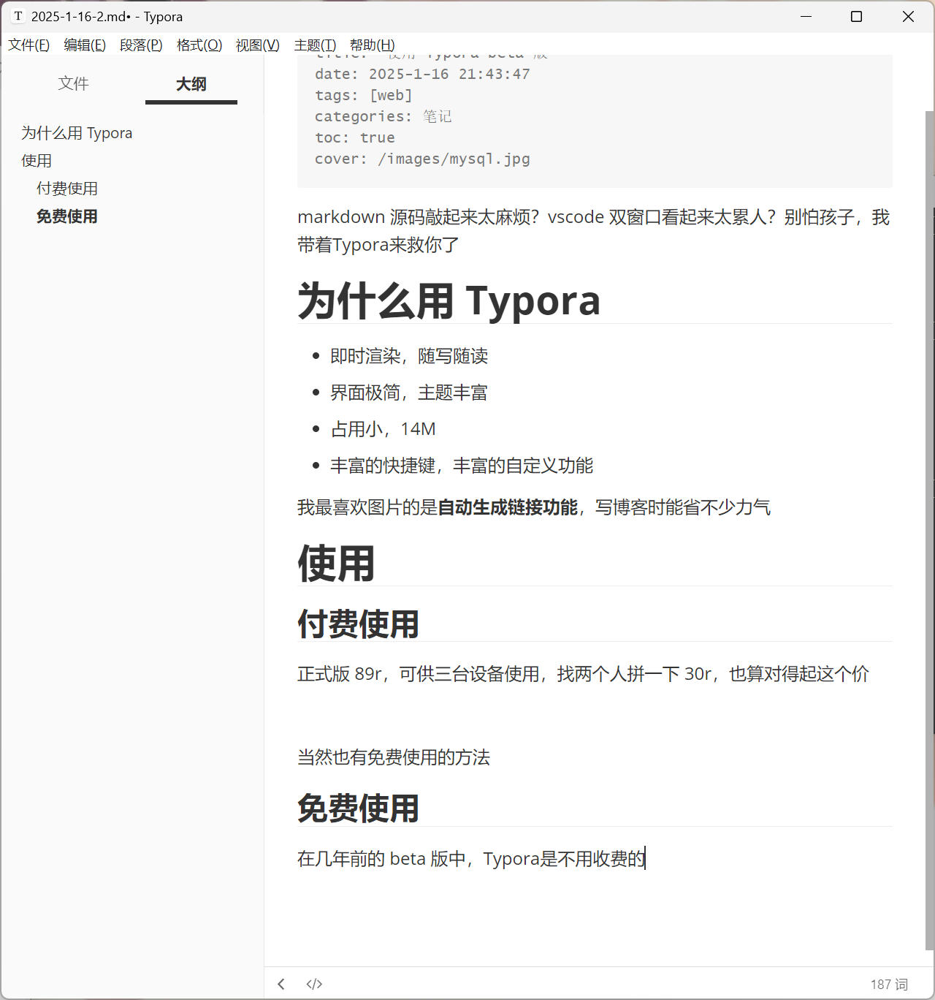
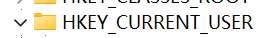

markdown 源码敲起来太麻烦？vscode 双窗口看起来太累人？别怕孩子，我带着Typora来救你了

# 为什么用 Typora

- 即时渲染，随写随读
- 界面极简，主题丰富
- 占用小，14M
- 丰富的快捷键，丰富的自定义功能

我最喜欢图片的是**自动生成链接功能**，写博客时能省不少力气

# 使用

## 付费使用

正式版 89r，可供三台设备使用，找两个人拼一下 30r，也算对得起这个价

当然也有免费使用的方法

## 免费使用

在几年前的 beta 版中，Typora是不用收费的，这里我使用的就是最后一代 beta 版 0.11.18

虽然直接使用会报错并提醒你强制更新，但是我们可以通过一些手段规避这个报错

首先，你应该充分使用**搜索引擎**，下载到如下文件

双击安装，然后运行，发现报错

这里使用 win + R 调出**运行**界面，输入**regedit**打开注册表

依次找到如下文件

右键点击，找到**权限**，进入界面

将所有用户的**完全控制**和**读取**权限禁用

然后你就可以正常使用这个版本的 Typora 了