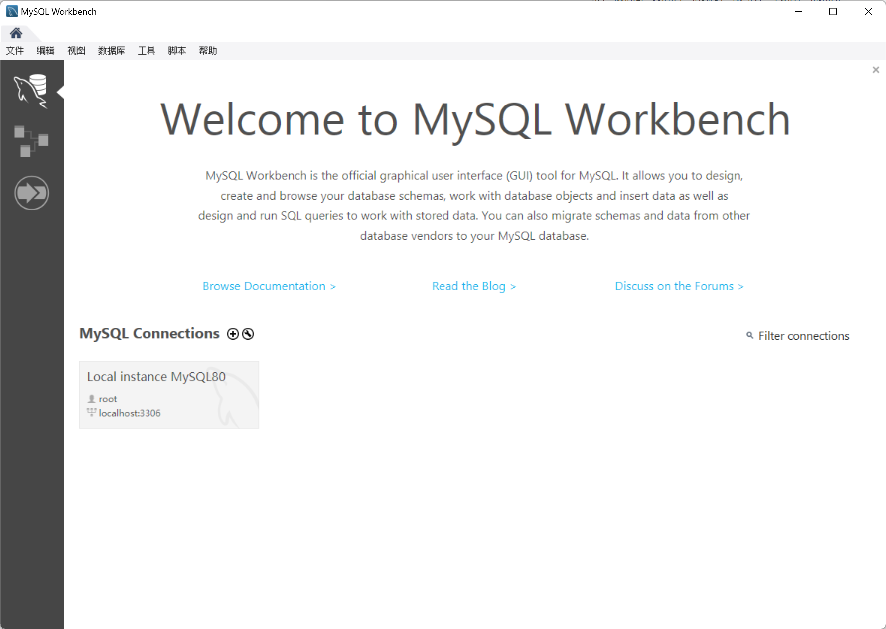
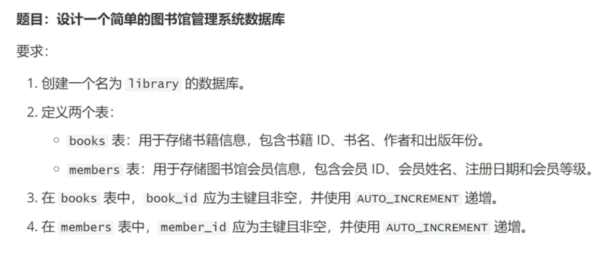
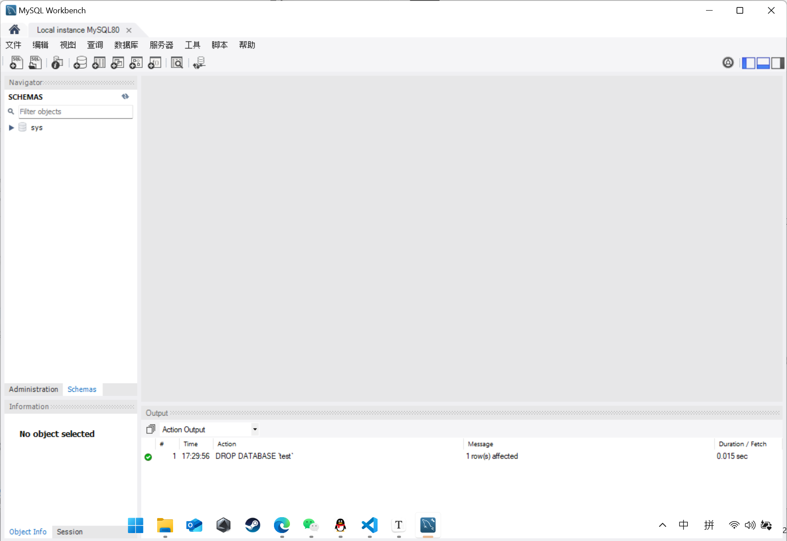
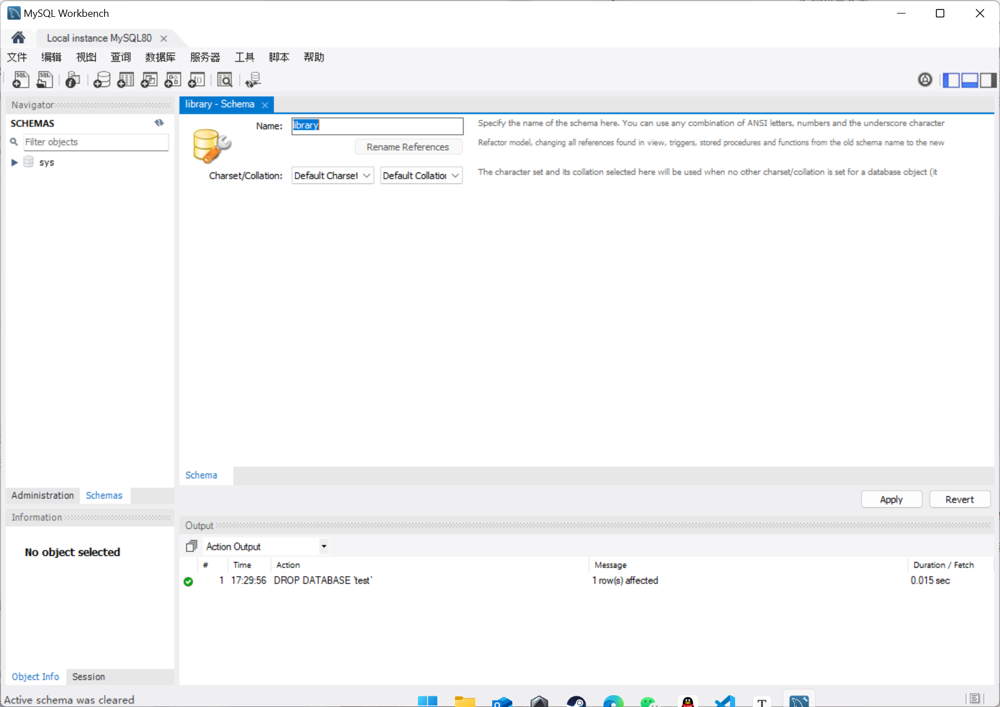
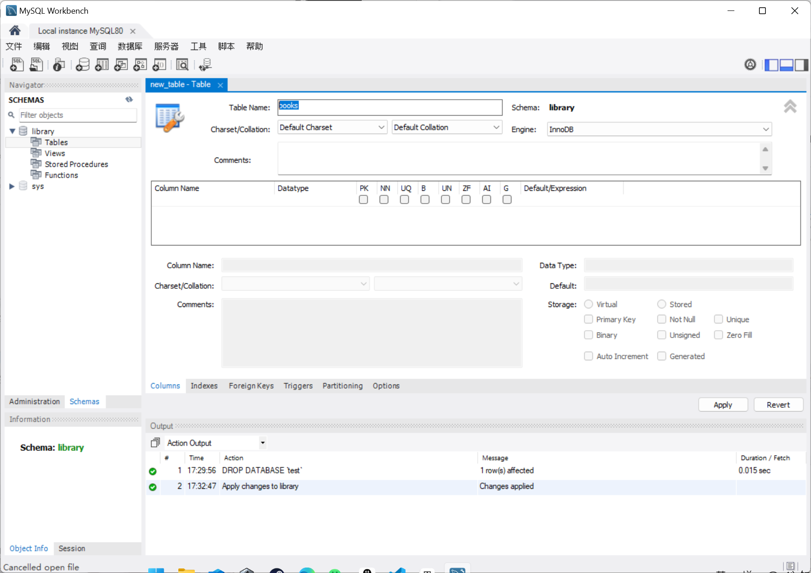
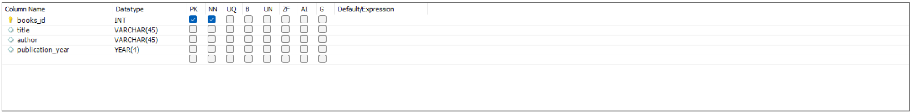
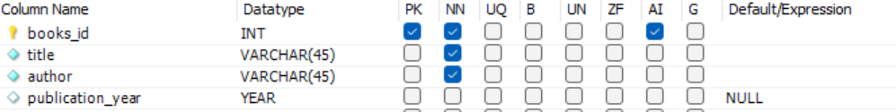

# MySQL Workbench 

## 简介

MySQL Workbench的一系列功能包括：执行查询语句、查看性能报告、可视化查询计划、管理配置及检查模式、生成ER图、数据迁移等等。MySQL Workbench支持在Windows、MacOS以及Linux平台上安装使用，几乎覆盖了开发人员和管理人员使用的全部平台。用户可以从MySQL的官方网站下载各种版本

# 连接

比如这里本身就会连接安装在你电脑里的 MySQL 服务，可以看出占用在默认的 3306 窗口

也可以在这里远程连接你的云服务器或者云数据库，配置好 ip 地址和端口号即可

# 基本操作

这里我们使用一个案例来进行学习

进入如下窗口

点击上方 new schema 按钮新建数据库，即可创建新的数据库

在数据库中的 table 栏我们可以新建自己需要的表

在新建字段时，我们可以注意到后面的神秘字母，这是对这个字段的**约束**

> ## 约束
> - PK(**PRIMARY KEY**) 主键，唯一标识表中的每一行记录，字段不能有 NULL 值，一个表只> 能有一个主键，一般用于 ID 
> - NM(**NOT NULL**) 非空键，字段不能有 NULL 值
> - UQ(**UNIQUE**) 唯一键，使用后字段中的所有值是唯一的
> - AI(**AUTO_INCREMENT**) 自增键，自动生成唯一的递增值，每个表中最多只能有一个 AI 字段

我们按照要求进行如下约束

books 表设置完成

剩下的内容如法炮制即可