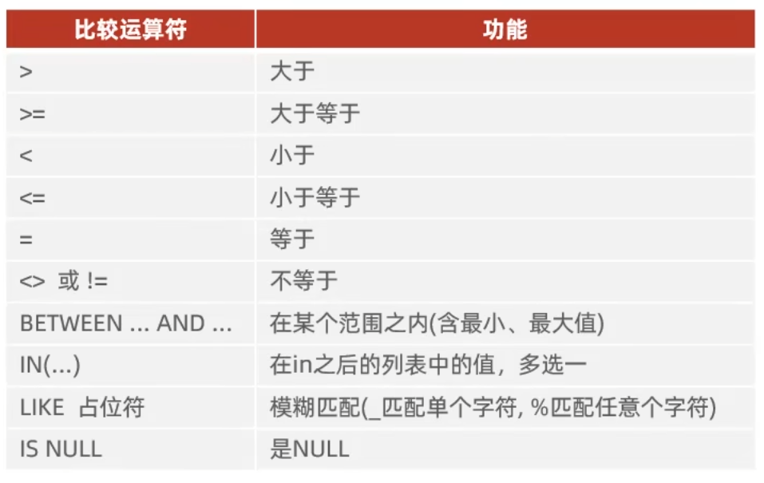
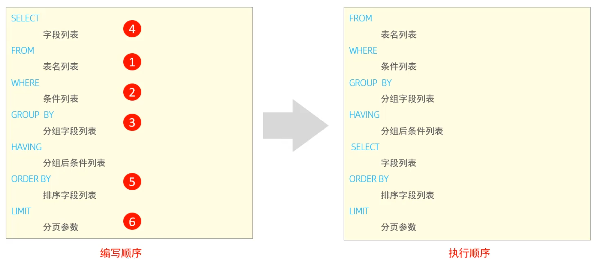

# SQL

## DML

DML 用来完成数据的增删改

- INSERT
- UPDATE
- DELETE

### INSERT

给指定字段添加数据

```sql
INSERT INTO 表名(字段名1, 字段名2, ...)	VALUES(值1, 值2, ...);
```

给全部字段添加数据

```sql
INSERT INTO 表名 VALUES (值1, 值2, ...);
```

批量添加数据

```sql
INSERT INTO 表名(字段名1, 字段名2, ...)	VALUES(值1, 值2, ...), (值1, 值2, ...), (值1, 值2, ...);
INSERT INTO 表名 VALUES (值1, 值2, ...), (值1, 值2, ...), (值1, 值2, ...),;
```

### UPDATE

基本语法

```sql
UPDATE 表名 SET 字段名1 = 值1, 字段名2 = 值2, ...[WHERE 条件]
```

无条件会修改整张表的**所有数据**，可以用`WHERE`指定 id

### DELETE

基本语法

```sql
DELETE FORM 表名 [WHERE 条件]
```

无条件会删除整张表的**所有数据**，可以用`WHERE`指定 id

DELETE 语句**不能**删除某一个字段的值（可以使用 UPDATE 修改值为 NULL）

## DQL

 DQL 用来查询数据库表中的记录

查询关键字**SELECT**

基本语法结构

```sql
SELECT
	字段列表
FROM
	表名列表
GROUP BY
	分组字段列表
HAVING
	分组后条件列表
ORDER BY
	排序字段列表
LIMIT
	分页参数
```

### 基础查询

```sql
SELECT
	字段列表
FROM
	表名列表
```

查询多个字段

```sql
SELECT 字段1, 字段2, 字段3, ... FROM 表名;
SELECT * FROM 表名;                       // 查询所有字段
```

设置别名

```sql
SELECT 字段1[AS 别名], 字段2[AS 别名], ... FROM 表名;
```

其中`AS`可以省略，这里的别名反映在数据库**返回的信息关键字上**和**HAVIING条件的使用上**

去除重复记录

```sql
SELECT DISNTNCT 字段列表 FROM 表名;
```

这里的查询均是不带条件的，也就是说不会对 id 做出筛选，直接返回该字段的所有内容

### 条件查询

```sql
SELECT 字段列表 FROM 表名 WHERE 条件列表;
```

条件构建形式




### 聚合函数

聚合函数，即将一列数据作为一个整体，进行**纵向**计算

常见聚合函数:

- count	统计数量
- max 
- min
- avg
- sum

语法

```sql
SELECT 聚合函数(字段列表) FROM 表名; // 这里的字段列表相当于函数参数
```

_所有的 NULL 值不参与聚合函数运算_

### 分组查询

语法

```sql
SELECT 字段列表 FROM 表名 [WHERE 条件] GROUP BY 分组字段名 [HAVING 分组后过滤条件]
```

WHERE 和 HANVING 的区别

1. 执行时机不同：WHERE 是分组之前进行过滤，不满足 WHERE 条件的不参与分组；而 HAVING 是分组之后对结果进行过滤
2. 判断条件不同：WHERE 不能对聚合函数进行判断，而 HAVING 可以

三个需求实例：

```sql
// 根据性别分组，统计男性员工和女性员工的数量
SELECT GENDER, COUNT(*) FROM EMP GROUP BY GENDER;

// 根据性别分组，统计男性员工和女性员工的平均年龄
SELECT GENDER, AVG(AGE) FROM EMP GROUP BY GENDER;

// 查询年龄小于45的员工，并根据工作地址分组，获取员工数量大于等于3的工作地址
SELECT ADRESS, COUNT(*) as CNT WHERE AGE < 45 FROM EMP GROUP BY ADRESS HAVING CNT >= 3;
```

_WHERE > 聚合函数 > HAVING_

_分组后，查询的字段一般是聚合字段和分组字段，查询其他字段无意义_

### 排序查询

语法

```sql
SELECT 字段列表 FROM 表名 ORDER BY 字段1 排序方式, 字段2 排序方式2;
```

- ASC    升序（默认）
- DESC    降序

_如果是多字段排序，当第一个字段值相同时才会根据第二个字段进行排序_

### 分页查询

语法

```sql
SELECT 字段列表 FROM 表名 LIMIT 起始索引，查询记录数;
```

- 其实索引从 0 开始，起始索引 = ( 查询页码 - 1 ) * 每页记录数

- 分页查询是方言，不同 SQL 数据库语法不同
- 若只查询第一页，则起始索引可以省略，简写为 LIMIT 10

_查询结果为指定的那一页_

### 执行顺序

