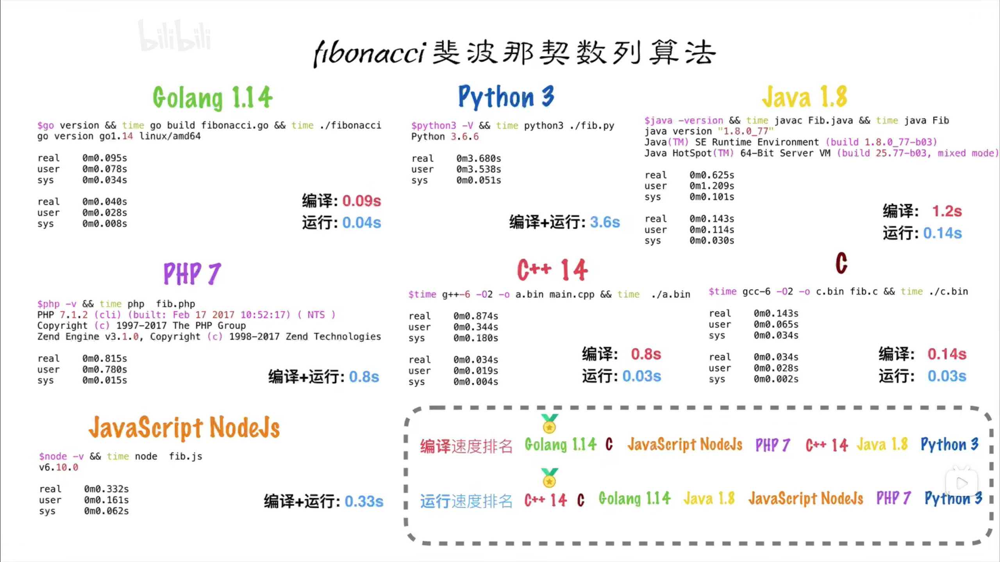

# 我为什么要使用 Go

在后端开发中，虽然 JavaScript 原生支持异步编程，但是由于 Node.js 是单线程的，仍不适合 CPU 密集型任务

虽然依托于号称外星科技的 V8 引擎，但其作为一门解释性语言，性能终究是不如编译型语言的

所以这里我们考虑使用 Go 来尽进行后端的开发

## Go 的优点

- 极其简单的部署方式
  - 直接编译为机器码
  - 不依赖其他库
  - 直接运行即可部署
- 静态类型语言
  - 编译的时候能够检查出来隐藏的大部分问题（ JS 落泪）
- 语言层面的并发
  - 原生支持**并发**
  - 充分利用多核 （使用`go`关键字开启协程）
- 强大的标准库
  -  runtime 系统调度机制
  - 高效 GC 垃圾回收
  - 丰富标准库
- 简单易学（这里点名一个 R 字开头的语言）
  - 关键字较少（25个）
  - 内嵌 C 语法支持
  - 面向对象的特征（继承、多态、封装）
  - 跨平台
- **大家都在用**
  - Google、facebook
  - 腾讯、百度、阿里、字节

## Go 的知名产品

- docker
- kubernetes

## 缺点

- 大部分第三方库都在 github 上
- 所有的 Excepition 都用 Error 来处理

_[我认为很好的 Golang 学习教程](https://www.bilibili.com/video/BV1gf4y1r79E/?share_source=copy_web&vd_source=6b438c91e58eb29d4b7f190b8674a85f)_