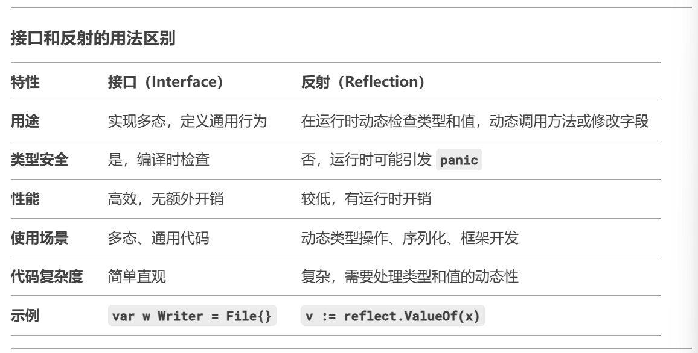

**前置条件**：学习过 Go 中的 interface 和 interface{} 特性，**Reflect** 特性的实现是基于 interface 的底层表示来实现的

# 变量的内置 pair

在理解 Reflect 特性前， 我们需要对 Go 中变量的底层结构有一个基本的理解

Go 中所有的变量在底层都存在一个键值对 pair

- type（二者选一）
  - static type（int、string... 等基本类型）
  - concrete type（interface 所指向的具体类型）
- value

反射，即通过该 pair 来得到变量的 type 和 值

```go
package reflecttest1

import "fmt"

func Reflecttest1() {
	a := "aceld" // pair<type: string, value: "aceld">

	var allType interface{} = a // pair<type: string, value: "aceld">

	str, _ := allType.(string)
	fmt.Println(str) // aceld

}
```

由上述代码可见，不管接口指针如何改变，变量内容中的 pair **始终不变**

# 反射机制用法

不多说，上代码

```go
package reflecttest2

import (
	"fmt"
	"reflect"
)

func reflectNum(arg interface{}) {
	// 通过反射获取传入参数的类型和数值
	fmt.Println("type = ", reflect.TypeOf(arg))
	fmt.Println("value = ", reflect.ValueOf(arg))
}

func ReflectTest2() {
	num := 1.2345

	reflectNum(num)
}

```

以上我们通过反射获取了变量的基本类型，接下来我们试着获取变量的复杂类型

```go
type User struct {
	Name string
	Id   int
	Age  int
}

func (u User) Call() { // 这里注意区分该方法所在的方法集属于 User 还是 *User
	fmt.Println("User is called...")
	fmt.Printf("%v\n", u)
}

func DoFiledAndMethod(input interface{}) {
	fmt.Println("DoFiledAndMethod is called...")
	// 获取 input 的 type
	inputType := reflect.TypeOf(input)

	// 获取 input 的 value
	inputValue := reflect.ValueOf(input)

	fmt.Println("inputType is ", inputType.Name())
	fmt.Println("inputValue is ", inputValue)
	// 通过 type 获取字段
	// 通过 type.NumField() 获取字段的个数，并进行遍历
	for i := 0; i < inputType.NumField(); i++ {
		field := inputType.Field(i)
		// 通过 type.Field(i) 的 interface() 方法获取字段的值
		value := inputValue.Field(i).Interface()
		fmt.Printf("%s: %v = %v\n", field.Name, field.Type, value)

	}
	// 通过 type 获取方法
	// 通过 type.NumMethod() 获取方法的个数，并进行遍历
	for i := 0; i < inputType.NumMethod(); i++ {
		// 通过 type.Method(i) 获取方法
		method := inputType.Method(i)
		fmt.Printf("%s: %v\n", method.Name, method.Type)
	}
}

func ReflectTest2() {
	user := User{"Aceld", 1, 18}

	DoFiledAndMethod(user)
}
```

通过 Reflect 机制，我们可以对实现 Go 中的**结构体标签**特性

# 反射与接口的区别

大致来讲，interface 用于在编译时实现多态，实行静态类型检查，实现通用的类型行为

而 reflect 用于在程序运行时检测变量的类型与值，用来实现动态的类型操作与多态

注意这里静态与动态的概念与 **C++** 中**不一致**



[Relect 实战案例](<[深入探索Go语言反射机制:reflect包的高级用法和实战技巧-CSDN博客](https://blog.csdn.net/walkskyer/article/details/142545930)>)

[我认为很好的 Golang 学习教程]( https://www.bilibili.com/video/BV1gf4y1r79E/?share_source=copy_web&vd_source=6b438c91e58eb29d4b7f190b8674a85f)\_
