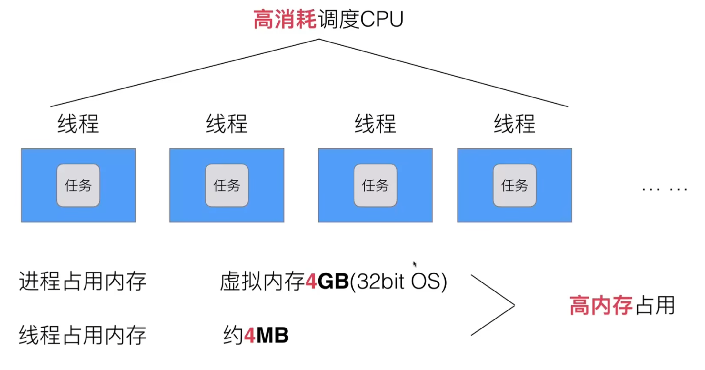

# 多进程处理

## 早期单进程操作系统

最早的时候系统设计并没有考虑多进程的实现，所有进程都是随着时间推移由 CPU 去线性完成的

- 单一执行流程，计算机只能单独处理任务
- 进程阻塞带来 CPU 的时间浪费

如何宏观上实现多任务并行呢

## 多线程/多进程操作系统

使用 **CPU 调度器**进行时间切片，以类似于流水操作的方式完成所谓的多进程并行（_实际上是并发_）

**然而**，这种方式实现的多线程操作会耗费巨量的时间与空间用于 CPU 的线程切换，CPU 浪费时间成本极高

进程/线程的**数量越多**，切换**成本越大**，越**浪费**

并且，多线程开发中程序员要考虑 **同步竞争**等多方面问题，开发难度**越来越复杂**

还伴随着**高内存占用**



# 协程

这里，Go 语言的开发者想到，是否能将单一线程分为**用户空间**和**内核空间**

然后将用户线程和内核线程进行绑定，CPU 只拥有内核线程的**视野**，用户线程仅存在于内核之上的层面，称为**协程（co-routine）**

然后，我们适合用一个协程调度器，来绑定多个协程以实现并多线程操作，且此时 **CPU 对内核层之上的操作无感**

但是，此种方法当某一协程阻塞时，会对下一个协程产生影响，这是所谓的 N : 1 问题

## Goroutine

所以，考虑将内核空间也划分为多个线程，形成 M : N 结构，耗费部分 CPU 性能以解决问题

最终的性能指标在于对协程调度器的优化于处理

**Go **语言将协程（co-routine）改名为 Goroutine，并用魔法大幅降低了其内存占用（降至 KB 级别）

早期的 Go 语言使用全局 go 协程队列来实现调度，效果惨不忍睹

现代 Go 使用 GMP 结构，即

- G ———————— goroutine 协程
- P ———————— processor 处理器
- M———————— thread 线程

这个架构的具体细节，可以去看 blog 末尾的视频了解

这里我们看看如何开启一个 Goroutine

```go
package goroutineTest1

import (
	"fmt"
	"time"
)

func newTask() {
	i := 0
	for {
		i++
		fmt.Printf("new goroutine: i = %d\n", i)
		time.Sleep(1 * time.Second)
	}
}

func GoroutineTest1() {
	// 创建一个 go 程 去执行 newTask()
	go newTask()

	// GoroutineTest1 函数结束，函数启动的 go 程也会结束
	// fmt.Println("GoroutineTest1 goroutine exit!")

	i := 0
	for {
		i++
		fmt.Printf("main goroutine: i = %d\n", i)
		time.Sleep(1 * time.Second)
	}
}
```

或者我们使用 Goroutine 启动一个匿名方法

```go
func GoroutineTest1() {
	go func() {
		defer fmt.Println("A.defer")

		func() {
			defer fmt.Println("B.defer")
			fmt.Println("B")
		}()

		fmt.Println("A")
	}()

	for {
		time.Sleep(1 * time.Second)
	}
}
```

在 Goroutine 内任意位置使用 `runtime.Goexit()`退出 Goroutine

[我认为很好的 Golang 学习教程]( https://www.bilibili.com/video/BV1gf4y1r79E/?share_source=copy_web&vd_source=6b438c91e58eb29d4b7f190b8674a85f)\_