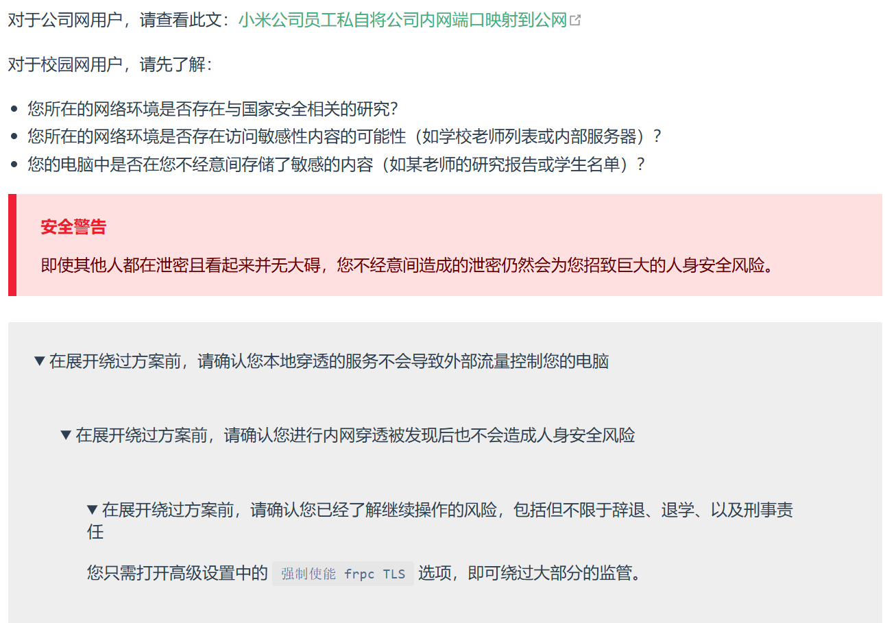

# 关于 Frp 的安全问题

曾今心心念念想要有低成本的实体服务器，在了解树莓派之后觉得终于有一个可行的解决方案了，遂自购树莓派4b开始折腾

某位同学曾使用过 Sakura Frp 内网穿透进行过游戏联机，于是打算用这个方案进行内网穿透

本来以为将局域网内设备暴露至公网不会出什么大事，直到在研究校园网/公司内网穿透方案时看到了如下两个帖子

道心破碎，开始重视 Frp 的安全问题

## 安全隐患

简单来讲，通过内网 Frp 客户端和外网 Frp 服务端之间的连接，可将内网打通，攻击者通过访问 frp 服务端主机的指定端口，可实现对内网路由可达的任意主机的访问

从影响上来讲，最坏的情况并不是进行穿透的主机被控制，毕竟个体身份的信息体量一般不会特意招致黑客攻击（笑），但是对局域网内其他设备的威胁确实是不容忽视的

尤其是在公司内网和校园网环境下，同局域网内的服务主机中存有重要信息的情况下，招致攻击的风险和后果严重程度都将大大提升

以校园网环境举例，一般**网信中心**都会对这类穿透服务进行拦截，然而，大多数 Frp 客户端，都有如下功能

当然，在这里只放这一张图片是不负责任的，我们将原版网页的截图放出

那么，为什么 Frp 方案有如此多的安全隐患，还能成为相当主流的一种公网方案呢？

除开低成本和众所周知的一些因素，其实是有对应措施缓解安全问题的，由于本人了解并不过深，这里仅列举几种

## Frp 安全方案

### 仅开放必要端口

 以 Web 网页为例，尽量只开放**默认80**端口，该端口一般由 Nginx 之类的反向代理工具提供服务，可以较为安全的进行代理转发，**较难(?)**被渗入

同时，**千万不要**轻易将 22/3389 端口暴露，默认 ssh 连接的22端口一旦被攻入，很容易取得主机的 root 权限，远程桌面的3389端口同理

若因实际需求**不得不**暴露这两个端口，请务必限制访问 ip 并设置**复杂度高**的相关密钥

### 强制使用 TLS 加密通信

你说的对，但是 TLS 不仅能绕过监管，其本身也是一种加密通信协议，这种服务能相当有效的阻挡中间人攻击

默认情况下的 Frp TCP 流量是明文传输的，攻击者可窃听或篡改传输数据(http 请求、数据库连接)，使用强制 HTTPS 和 TLS 服务能有效的对流量进行加密

### 使用高位端口

常见端口如 3000、5000、8080等端口尽量避免开放，这些端口比较容易被工具扫描，引发暴力破解或漏洞引用

### 隔离环境

主播主播，你的环境确实很危险，但是我就在家庭环境下开个 NAS，有没有什么强势又简单的安全措施

有的兄弟，有的

使用 DMZ 服务，可以在家庭网络下创建一个单独的区域，这个区域内的设备映射到网络中，即使被攻击或入侵，也不会影响到区域外的其他设备

具体操作涉及路由器操作，可以参照以下 up 的视频进行配置

[家庭网络下，玩内网穿透的服务器，是不是应该隔离防护一下]( https://www.bilibili.com/video/BV1S14y1P7SN/?share_source=copy_web&vd_source=6b438c91e58eb29d4b7f190b8674a85f)

## 忠告

保险起见，无论诸位大神的网安技能多优秀，我不建议任何人在校园网/公司内网环境下使用 Frp 进行内网穿透

实在想进行远程控制的同学们，可以研究更加安全的 VPN 方案

# Linux 云端操作感想

在折腾云服务器的时候，大致流程和树莓派差不多，少了 Frp 的一些奇怪问题后，Nginx 的配置简单了很多

但是，由于云服务器中定制 Ubuntu 系统相当安全(雾)的用户权限管理，网站搭建中 90% 的原因都来自于文件权限不足，剩下 10% 来自于用户服务的混乱

建议同学们在使用 root 进行操作和其他用户进行操作时遵循一定的规则逻辑，尽可能减少因为用户权限不同造成的各种奇怪bug

apt 作为包管理器确实相当方便，定制系统已经预先将镜像源换成了阿里云，在下载各种环境的时候并不需要像在 win 上一样折磨

考虑到代理问题，使用 apt部署简单网页环境的时候确实比 Docker 部署还好用，毕竟一 pull 半小时、一看已失败的效果非常容易让人红温

云服务的安全组规则和免费的 ddos 防护确实让人无比安心，愿意的话花点小钱(并非小)还能享受企业级的安全防护，不过2G2核的便宜服务器确实没什么黑入的价值就是了

vsc 的远程接入后 2G 的内存几乎能被吃满，我也不知道为什么 vsc-server 这么吃内存，感觉不如学着用一下 Vim，直接 powershell 进行 ssh 连接了