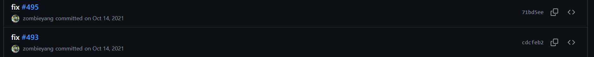
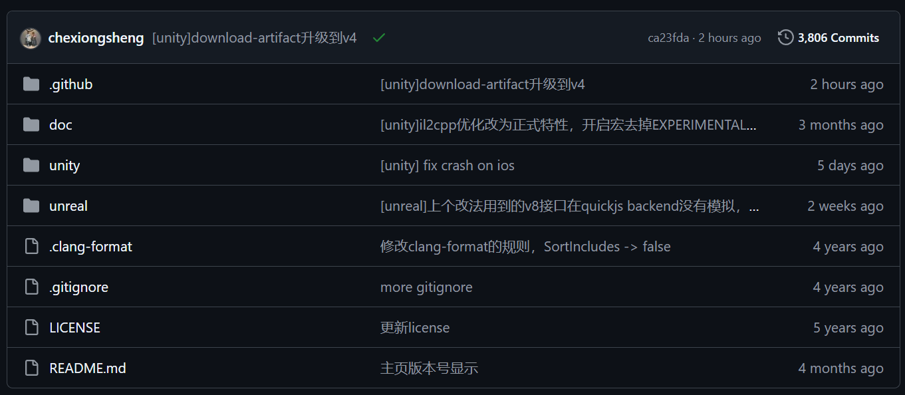
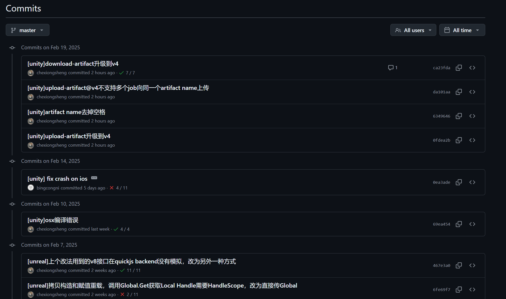
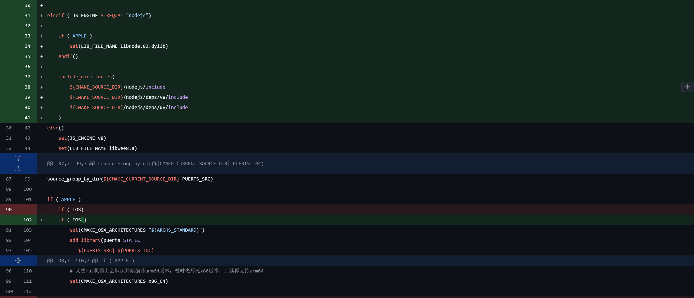

本人对此的认知有限，故本文只会聊一些最基本的规范

---

# Git

`Git`是一款免费且开源的分布式版本控制系统，旨在以高速和高效的方式处理从小型到超大型的各类项目。除去基本的版本管理，还可以借助 `ssh`等协议做到方便、安全的文件传输及代码共享

这里会简单介绍一些**我认为比较重要的`Git`使用规范**

## Commit

是的，使用`Git`最重要的一件事就是进行版本控制，而`git commit -m "<信息>"`命令就是提交当前更改的重要方式、

而 Commit 中信息的编写规范**非常重要**，可以非常直观的提供此次更改内容的变化情况，**尤其是在与合作者协同开发的情况下**，可以帮助他人一眼看出你的改动内容，是代码写完之后**非常重要**的一项流程

> [!WARNING]
>
> 存在不包含相关信息的 commit 命令，这里为了诸位的身心健康，不做介绍

有的同学可能会说了，我写完代码很累了，还要写 commit 不是折磨人吗？

想象一下，当您早上打开仓库开始工作，看的同事 commit 长成下面这样，您的血压会不会飙升

- `fix`
- `修改 bug`
- `设计页面`
- `2.12`
- `添加用户个性化设置功能, 实现用户主题与图片定制功能, 添加四个新API端点, 实现文件管理和Token验证......(此处省略一万字)`

心脏强大的同学，或者说完全不关心别人干了什么的同学可能觉得这样无伤大雅，但是为了世界和平，我必须在这里介绍一下规范的 commit 写法，并推荐大家按照规范合理的编写自己的 commit

当然有些同学可能在一些大的开源项目中看到如下提交



注意这里的提交是回应相关 issue 的，详细信息应转至对应页面查看

### Angular 规范

目前最受开发人员肯定的规范是前端框架`Angular`提出的[Angular 提交信息规范](https://github.com/angular/angular/blob/22b96b9/CONTRIBUTING.md#-commit-message-guidelines)

这里给出提交格式

```powershell
<type>(<scope>): <subject>
<BLANK LINE>
<body>
<BLANK LINE>
<footer>
```

每次提交**必须包括**页眉(`header`)内容，其余正文`body`和页脚`footer`视改动情况定

每次提交不超过`100`个字符

这里简单介绍一些`type`字段类型

- `build`：对构建系统或者外部依赖项进行了修改
- `docs`：对文档进行了修改
- `feat`：增加新的特征
- `fix`：修复`bug`
- `refactor`：既不是修复`bug`也不是添加特征的代码重构

更多详细信息可以参看连接给出的官方文档
这里搬运一些规范的`Angular`提交信息

```powershell
feat(UserProfile): add user profile editing feature

This commit introduces a new feature that allows users to edit their profiles
directly from the user interface. The motivation behind this change is to
enhance user interaction and provide a more seamless experience.

Previously, users had to navigate to a separate editing page to update their
profile information. With this new feature, users can now make changes
efficiently from their profile page, eliminating unnecessary steps in the
workflow.

Changes included in this commit:
- Added a new 'Edit Profile' button on the user profile page.
- Implemented frontend components for profile editing.
- Updated backend API to handle profile updates securely.

By streamlining the profile editing process, we aim to improve overall user
satisfaction and make our application more user-friendly. This enhancement is
in response to user feedback, addressing the need for a more intuitive and
accessible way to modify profile details.

Closes #234
```

```powershell
fix(Validation): correct input validation logic

This commit addresses an issue related to input validation logic in the
application. Previously, the validation process was not handling certain edge
cases correctly, leading to unexpected behavior in specific scenarios.

To resolve this issue, the validation logic has been revised to properly
handle various input scenarios. This ensures that user input is thoroughly
validated, reducing the likelihood of errors in the application.

The changes made in this commit include:
- Correcting boundary checks for user input.
- Improving error messages for better user guidance.

These adjustments align with our commitment to delivering a robust and
reliable application experience.

Closes #123
```

### 个人理解

有的同学可能会说了，小体量项目没必要写的这么规范吧，随便写写不就行了？

> [!WARNING]
>
> 以下内容仅代表我个人观点，若有不同意见，欢迎联系作者进行友好交流

如果同事或者队友明确表示不在意的话，请自便

其余情况，我个人建议您的提交起码包括以下内容

```
git commit -m "一句话交代大致工作

- 详细条目1
- 详细条目2
 - 子条目21"
```

其中，若提交能够被简短的一句话描述，可省略详细后续内容(务必确保您的工作能被**简短**的一句话**完全**概括)

其中，若改动内容较多 ，建议可以**稍微详细**的对后续条目进行编写(务必确保您的工作**不能**被**简短**的一句话**完全**概括)

这里给出作者的 commit 以供参考

```
修复查询帖子 bug 逻辑，新增用户历史发布 API

- 修复查询帖子(GET /search)空列表问题
 - 修复空列表重复响应200状态码
 - 新增响应 count 字段表示当前页数量

- 新增用户历史发布接口(GET /user-history)
  - 支持分页查询
  - 包含帖子总数、当前页数量统计
  - 返回帖子详情及关联图片

- 增改相关 API 文档
```

## 可视化查看工具

`Git`的基本操作是命令行命令，虽然对于基本的提交，拉取，推送之类的命令支持良好，但是当你需要查看具体改动的时候，命令行操作实在是相当不方便

这里提供几个**不需要特意下载的可视化工具**

### Github

`Github`作为世界上最大的开源代码托管平台，其名称中的`Git`已然彰显了其与`Git`的密切关系

这里以[Tencent/puerts: PUER(普洱) Typescript. Let's write your game in UE or Unity with TypeScript.](https://github.com/Tencent/puerts)仓库为例稍作演示

在仓库的代码主页，你能很轻松的看到 commit 标识



点击左上角 Commit，进入提交详情



这里已经能很详细的看到提交结果了，我们再点进详情页



这里的红绿色块非常明显的提示了相应的增改内容

### Vs code

你说的对，但是 vs code 内置了一款`Git`可视化工具，可以辅助进行更改的提交，推送

还有**好用**的冲突管理器，让你不用再`Git`默认的`Vim`编辑器中进行冲突的更改


这里给出官方使用文档[Visual Studio Code 中的 Git 简介](https://vscode.github.net.cn/docs/sourcecontrol/intro-to-git)

# README

一个好的项目，必然有一份好的`README`，无论这份`README`是面向开发者还是使用者，都应该进行认真地进行撰写

一份好的`README`是项目标配，然而其作用**并非**彰显该项目的专业性或满足自己的**展示欲**，您的`README`应该以**解决开发者或使用者可能存在的疑惑为目的**

古早的游戏文件中，常常能看见`txt`格式的`README`文件，直到现在有些游戏仍然使用`html`网页文件来进行项目描述

然而在如今的开源项目中，通常使用`markdown`语法来撰写`README.md`文件，GitHub 要求开源项目必须包含 README.md，否则会显示警告提示

那么，一份完整的项目`README`应该说明哪些内容呢？

- 软件定位及基本功能
- 运行代码的方法：环境、启动命令...
- 简要使用说明
- 代码目录结构说明
- 常见问题说明

作为一份完整的`README`，其还包括一些在代码**早期开发**中不需要填写的内容

- 版权和许可信息
- 作者列表
- 社区介绍
- 联系信息
- 法律声明
