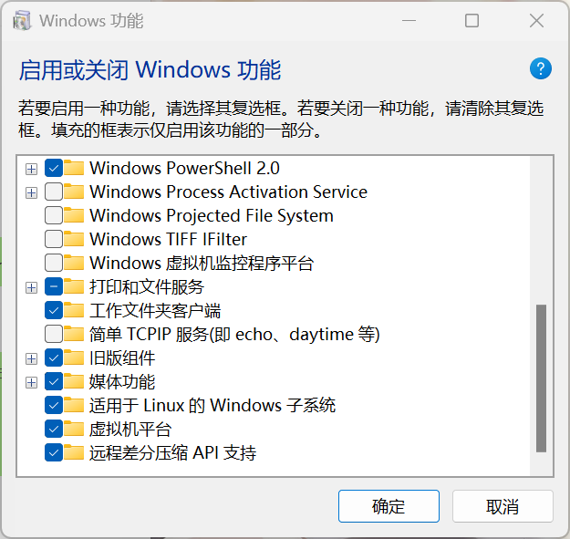
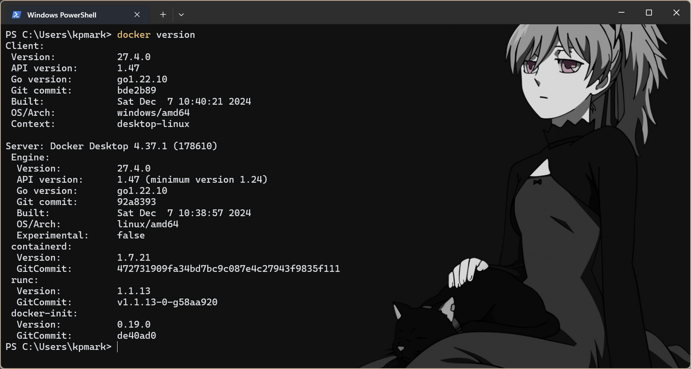

Docker 是一个轻量化的容器技术，它提供了一个独立的环境容器，用于打包和运行应用程序及其依赖。虽然 Docker 容器与虚拟机在功能上有相似之处（如提供隔离的运行环境），但 Docker 容器直接运行在宿主机的操作系统内核上，而不是通过虚拟化硬件来实现，因此更加轻量、快速和高效。Docker 镜像可以在任何支持 Docker 的环境中运行，确保开发、测试和生产环境的一致性

- Docker 用于将应用程序及其依赖打包成一个轻量化的容器，实现跨环境的一致性和快速部署

- 通过 Docker，开发者可以在隔离的环境中运行应用，确保开发、测试和生产环境的无缝迁移。

# 开启 WSL 环境

很不幸，Docker 原生支持的环境为 linux 和 mac OS，无法直接在 windows 系统中运行，我们需要开启 windows 自带的 linux 子系统

在 win10 环境中，只需要开启 hyperV，即可正常使用 Docker 的客户端(在系统设置中搜索即可)

而在 win11 中，我们需要开启 WSL 服务（WSL2 具有更好的新性能与兼容性，win10 用户在版本允许的情况下也推荐使用 WSL）

首先，打开 windows 设置中以下两项服务

- 适用于 Linux 的 Windows 子系统
- 虚拟机平台



然后，重启电脑，以管理员打开 CMD 或者 PowerShell，输入以下命令将 WSL 的默认版本切换至 WSL2

```powershell
wsl --set-default-version 2
```

然后，输入以下命令下载 WSL

```powershell
wsl --update --web-download
```

祈祷成功即可

理论上以上操作之后即可正常下载 Docker 客户端，但是你也可以在 WSL 中下载 Ubantu 或者 Arch 这种 linux 发行版当成虚拟机折腾一下

# 下载 Docker 客户端

推荐直接使用神秘力量进入 Docker 官网下载 docker_desktop_installer_windows_x86_64.exe，当然如果没有什么力量也可以在国内下载到各种镜像下载器

注意通过安装包引导安装是不能指定安装位置的，这里建议在命令行中通过以下命令指定安装路径

```powershell
start /w "" "Docker Desktop Installer.exe" install --installation-dir=D:\Docker
```

打开 Docker Desktop 的客户端，成功运行即可

输入`docker version`，得到以下结果即安装成功



这里的客户端提供的云服务与图形化界面，由于十分便于理解这里不做介绍，以下操作仍使用命令行

# 使用 Docker 运行 Redis 服务

Redis 是一种基于内存的高性能键值存储系统，广泛用作缓存、消息队列和会话存储，以提升应用性能

由于不明原因，其最新版本只能运行于 mac OS 和 linux 上，windows 只存在一个非常古老的版本，这里我们使用 Docker 运行 Redis 服务

在具体项目中要配置的环境不止一种，建议使用 docker-compose 的方式编写配置文件，这里以 MySQL 和 Redis 为例

在配置根目录下新建文件 `docker-compose.yml`，写入如下内容

```dockerfile
version: '3.8'

services:
  mysql:  # MySQL 服务定义
    image: mysql:8.0  # 使用官方 MySQL 8.0 镜像
    environment:
      MYSQL_ROOT_PASSWORD: root   # 设置 root 用户密码
      MYSQL_DATABASE: marketplace # 自动创建数据库
    ports:
      - "3307:3306"  # 将容器内的3306端口映射到宿主机的3307
    healthcheck:  # 健康检查（可选）
      test: ["CMD", "mysqladmin", "ping", "-h", "localhost"]
      interval: 5s
      timeout: 10s
      retries: 5

  redis:  # Redis 服务定义
    image: redis:alpine  # 使用轻量级 Redis 镜像
    ports:
      - "6379:6379"  # 端口映射
    command: redis-server --save 60 1 --loglevel warning  # 每60秒保存一次

```

其中两项服务为了便于开发测试，均未设置持久卷

以上文件其实包含了两个容器的配置，一旦启动该 docker 服务，对应得镜像便会依照配置运行在容器内部，我们可以通过其映射的宿主机端口访问服务

- 在根目录下使用`docker-compose up -d`运行容器，`-d`参数使其在后台运行
- 使用`docker-compose down -v`删除容器，`-v`同时删除其临时卷
