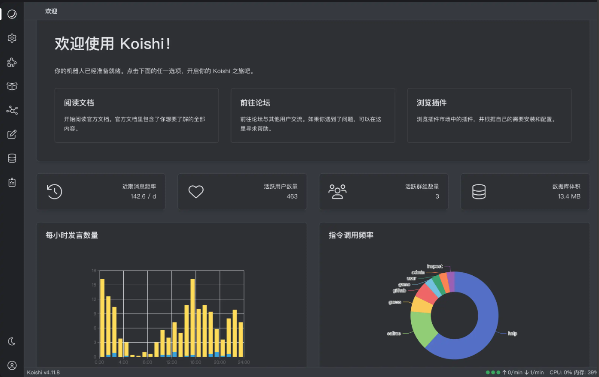

[markzhang12345/vvBot: 一个基于 LagrangeGo-Template 和 vv433 的自动 vv 表情包 qq 机器人](https://github.com/markzhang12345/vvBot)

之前看到一个有关 vv 的开源项目，感觉特别有意思

[Cicada000/VV: 你还在为自己存放的 VV 表情包不够多，使用时觉得不够贴切而感到烦恼吗？快来试试这个项目吧！](https://github.com/Cicada000/VV)

当时觉得实现一个能够自动发送 vv 表情包的机器人特别有意思，但是手头事情很多，就暂时搁置了

虽然当天就看到某个学长已经实现了类似的机器人，但还是想着自己能不能复现一次

于是这几天，忙里偷闲整出来一个


# 框架选择

## koishi

开始了解有关机器人的框架，发现好像 koishi 很火，而且需要的环境正好全部都有，甚至还有管理面板，于是打算使用 koishi



然而，开始阅读文档之后，发现实现自己的自定义插件好像不如我想的那么简单，而且，最重要的是，我需要的第三方 Bot 插件已经不能用了


于是决定转战其他框架

## LagrangeGo

在使用搜索引擎简单检索之后，决定尝试使用 LagrangeGo 这款协议

这玩意是本质上是 Lagrange.Core 的 Go 语言实现，其中 Lagrange.Core 的官方文档中存在的实现方式有如下几种：

- C#
- Python
- Golang

你说的对，但是我不会 C#，不如说最近看某个项目的 C# 代码看的我及其头大。Python 又总是给我一种效率低的**错觉**，可以的话还是想用编译型语言

所以最后选择用还算熟悉的 Golang 进行编写

LagrangeGo 的[仓库](https://github.com/LagrangeDev/LagrangeGo)中，说明这个协议实现不推荐直接使用，可以用基于此项目的 [go-cqhttp](https://github.com/LagrangeDev/go-cqhttp) 或者模板框架 [ExquisiteCore/LagrangeGo-Template](https://github.com/ExquisiteCore/LagrangeGo-Template) 实现

我一看，欸，go-cqhttp 也被大手 👊🐔 了， 而且我想实现的 bot 暂时也不需要集成那么多功能，于是选择了使用 LagrangeGo-Template

# 功能实现

想要在模板的基础上添加功能，我们需要简单了解这个模板的构成

让我来看一看源码，嗯...


好，让我们来编写这个 bot 的功能

## 调用 API ?

注意到，文章开头提到的 Cicada000/VV 提供了一个具有模糊搜索功能的 API 调用， 我一开始的想法是直接调用这个 API，然后获取对应的表情包

折腾了一下，发现这玩意的响应竟然是一组 json 而不是一个，让我调试了半天

然后解析他给我的 json，发现只给出来对应表情视频帧的位置

没找到视频在哪里，所以开始想其他办法


## 使用 vv433

某位好友在这个时候向我提供的他的武器库，vv433 —— 带有标题的 433 张 vv 表情包，于是决定直接调用武器库

简单整理 vv433，只保留 png 格式文件，改装成 vv428

考虑到功能对于文件访问的高频性，这里简单将武器库的文件名整理成 json 文件，以便直接放进 go 程序的内存，实现快速查询

写个 Python 脚本

```python
import os
import json

source_dir = 'vvSource'
output_file = 'filenames.json'

png_files = []
for filename in os.listdir(source_dir):
    file_path = os.path.join(source_dir, filename)
    if os.path.isfile(file_path) and filename.lower().endswith('.png'):
        png_files.append(filename)

png_files.sort()

with open(output_file, 'w', encoding='utf-8') as f:
    json.dump(png_files, f, indent=4, ensure_ascii=False)

print(f"已生成 {output_file}，包含 {len(png_files)} 个PNG文件。")
```

## 搜索逻辑

实在没时间写模糊语义处理，而且也不会写，于是直接暴力查询

先全字匹配，再部分匹配，匹配不到就随机，匹配到多个也随机

只能说 vv 还是太全面了，随机出来的表情包意外的有节目效果


这里不再贴出源码了，想看的直接去仓库看就行

---

修改于 2025-4-6

其实几周后就做了个简单的模糊语义处理，但是太懒了所以现在才发

也没有什么，因为我自己实在不会写，Go 有没有现成的好用的库，所以干脆直接把选择逻辑全扔给 AI 做了，顺便写了几个好玩的（神必的）AI 交互

# 待实现

- 模糊语义搜索（升级版）

- 绕开 QQ 的机器人检测

你说的对，但是我头一天只是调试了一下 bot，第二天号就被封了

姑且是加了点随机时延，然后增加了手动发送文字功能，但还是觉得不保险

正在想怎么模拟正常用户的行为


