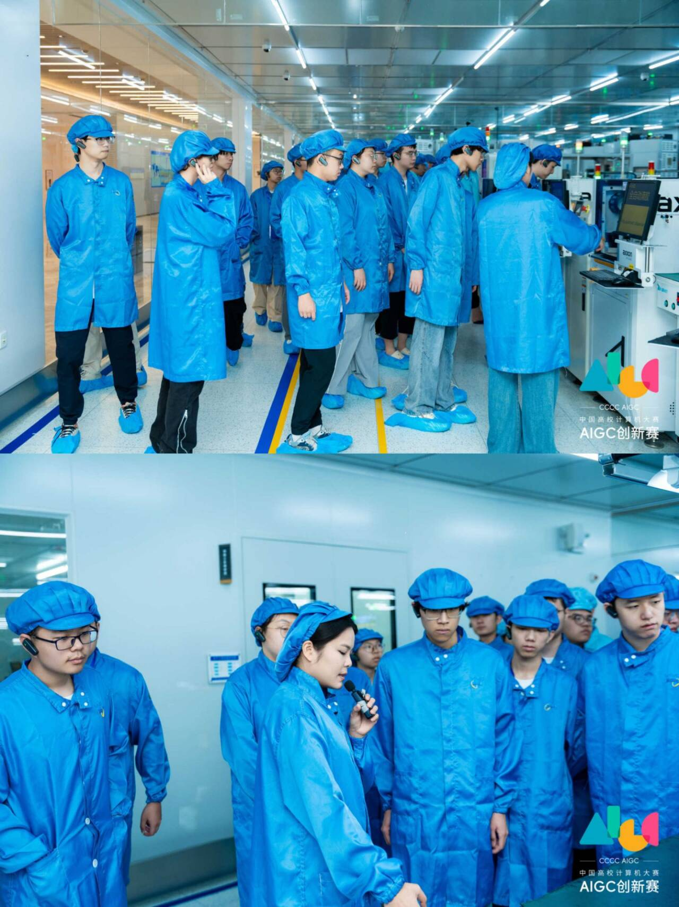
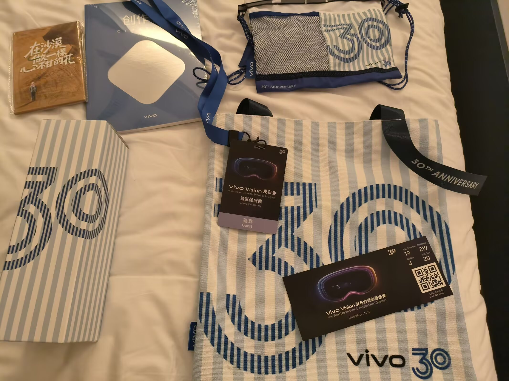
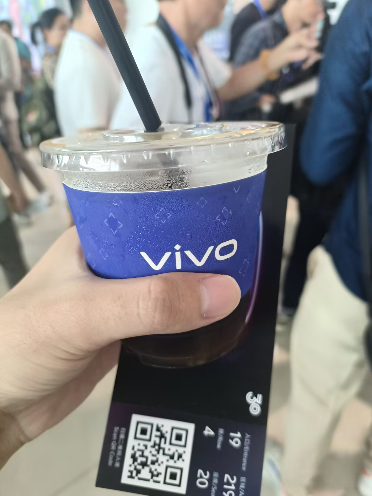
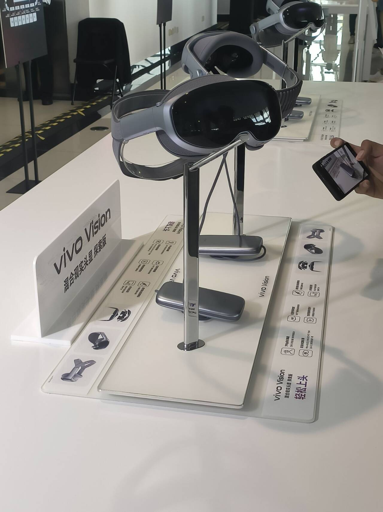
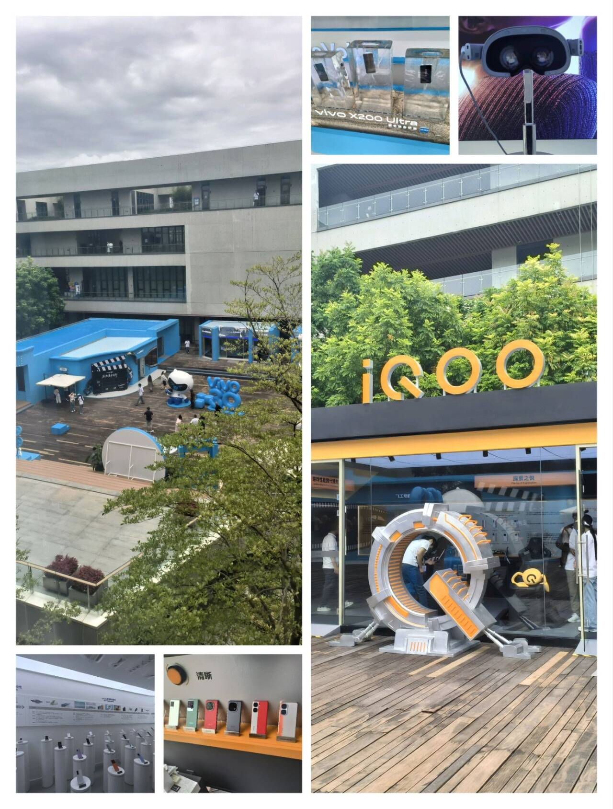
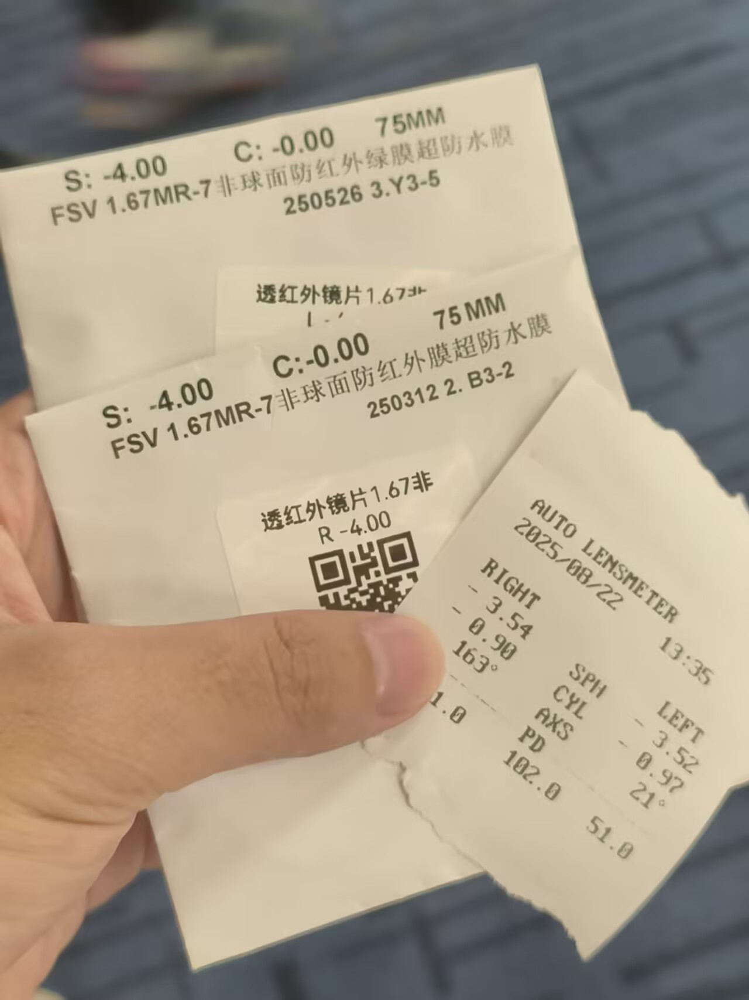
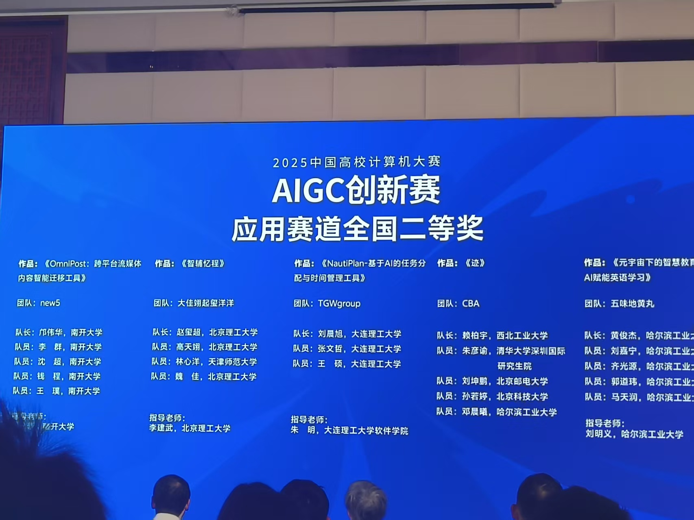

欢迎参加中国高校计算机大赛 · AIGC 创新赛

---

吃了第二届参加人数少的福利，我们这种做了一个月的毛胚项目也能进国赛

vivo 给参与国赛的每个队伍提供了夏令营集训和 vivo vision 发布会暨影像盛典的名额，于是兴高采烈的和队友跑跑了两趟东莞（只是可惜去年答辩是在天津，今年去不了

## 夏令营

vivo 邀请我们参观了园区和他们的自动化车间

以前只在电视和报道中看过自动化车间，这次能够亲身感受自动化车间的工作氛围实在幸运

可惜 vivo 不让给设备拍照

然后上了好多课，听了好多讲座，参加了模拟答辩

深切感觉到自己的项目能够挤进国赛有多么不可思议

其他团队的项目，要么是策划已久，方案齐全详尽的软件计划，要么是他们实验室的科研成果转化

相比之下我们的项目就很苍白了，正紧开发也就是不到一个月，正儿八经参与开发的也就两个人，PPT 也非常简陋，演示视频效果也不好......

于是老实回家打磨软件，写屁屁踢

## 发布会

因为暴雨和航空管制耽误半天之后，总算是又飞到了东莞

vivo 提前给了伴手礼，有一个挎包，一个水杯，一个创作者日记和一盒明信片

隔天去会场参加正式的发布会

会场在东莞体育馆，中心看台被改成了发布会场地，四周的场馆做成了展馆

有 vivo vision 的展台，vivo 自家摄影比赛的展台，和**茶歇（重点**

（拿到一杯他们家的 🍊 美式，太甜了

正式的发布会上，其实大多数功能直接看隔壁 🍎 的 vision pro 就能知道个大概，比较值得一提的就是重量达到了 398g，很轻便

vivo 自己也知道这个产品的成熟度远没到可以售卖的阶段，所以发布的是所谓**探索版**，仅仅开放了线下授权店的体验

但是要我说他这个支持 windows 电脑串流和安卓手机投屏已经赢了 vision pro 太多了

现场没开放体验，但是我们第二天有去园区体验的机会

vivo 的园区正好在 30 周年纪念活动，除了这些 vivo vision 的体验也有其他展览（比如把手机冻进冰块的神必操作

碍于时间限制没法完整体验完所有流程，也不能看完 vivo park 的演出，但是我们仍然可以到二楼完整体验一下 vivo vision 的功能

vivo 为戴眼镜的朋友提供了度数测量和镜片匹配服务

_（虽然但是，我感觉他测量的并不是很准，我和队友两个人的镜片效果都差强人意）_

在工作人员的帮助下，我把 vision 支持的功能基本都体验了一遍

首先通过 vision 扫描我的头型，选择合适我的面罩

然后是视频收看，他提供了一段常规的视频，但是可以通过头显进行全屏放映

实际体验下来非常类似电影的观感，我认为是这其中最让人惊艳的功能了

之后看了有 180° 和 270° 的视频，每个 VR/MR 的必吃环节，不多赘述

所有应用窗口都是可以自定义在空间各处的，体验很不错，但是官方宣传里说是打工牛马专属工具......

既然是 MR，肯定得有增强现实的部分，我没有体验他给出的神秘小音游，而是选择了一段交互演出，大致还是和虚拟人物互动，实际上现实的部分不多

当时给出的演示地点空间不大，不然可以走动观赏，据工作人员说可以看到建模很精密的地方，但是我持怀疑态度

---

总体来讲，我觉得 vision 作为影音设备的功能是非常强大的

但是手眼交互这块，说实话没有达到发布会给我的预期

然后 MR 交互也差强人意

期待正式版这些问题能够得到改进

## 决赛答辩

发布会之后，我们从原来的酒店转移到了东莞迎宾馆

_给我干那来了，这还是国内吗.jpg_

我是真没想到还能住上一次五星级酒店，企业赞助的比赛就是有底气，你说是吧 xx

---

止步国二，但是结果已经超出我的预料

从五月的一个想法，到小学期的正式开发，再到八月的夏令营和包装

满打满算一个多月的开发，有过因为赶进度一天只吃一口饭，也因为 ddl 之前的 bug 红温过，在模拟答辩被其他组比的一无是处，在电脑前对着不擅长的 ppt 抓耳挠腮

我们不像其他队伍有着祖传代码和科研底蕴，也没有博士生研究生过来代打。他们有产品，开发，UI，答辩，而我们正经参与开发的就两个大二，还要靠着自己稀碎的审美做屁屁踢剪视频

但是第一次，在正式比赛的答辩中，我没有紧张到手无足措

从需求，到架构，到开发，到美化，到包装

每一行代码，每一行字，每一处技术栈我都深度参与，没有 AI 给的乱七八糟的屎山，我头一次对每一处内容都有把握

这个结果，我心满意足

感谢队友，没有他的端侧我们甚至进不了决赛，感谢自己，没有在最红温的时候撂挑子不干

感谢焦头烂额的那一个个日日夜夜

> 修改于 8 月 25 日晚，东莞迎宾馆
>
> kpmark
