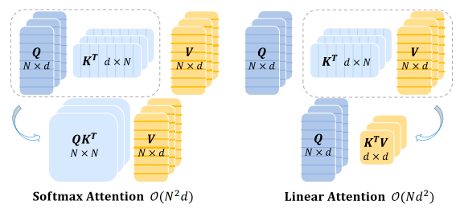
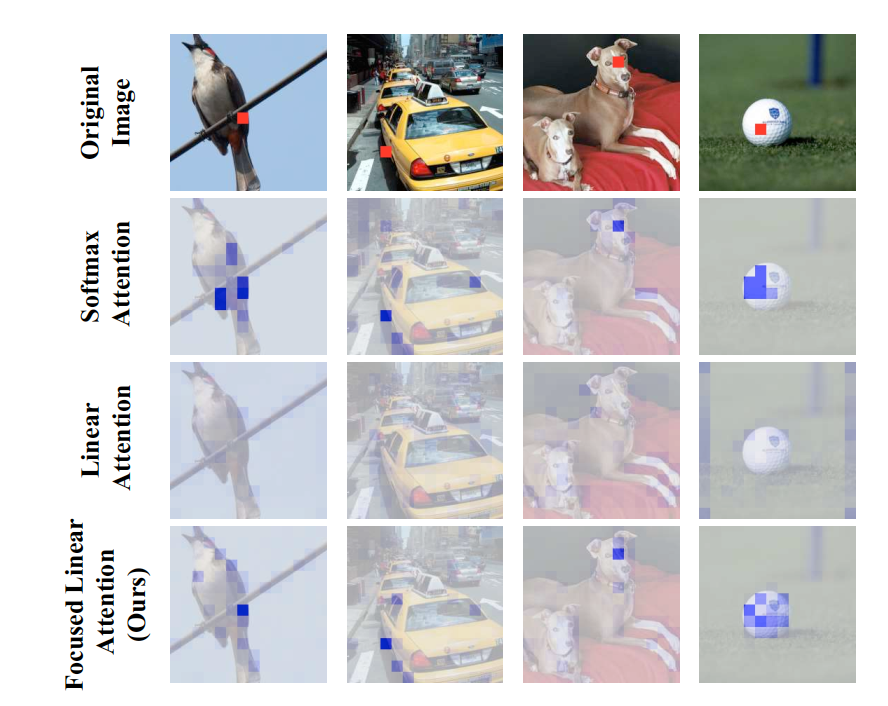
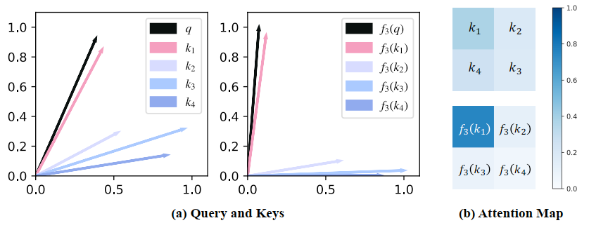
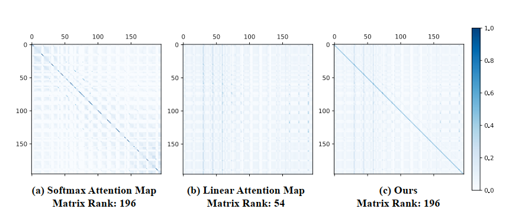

# Flatten Transformer

## Abstract

**二次计算复杂度**

来源于 Dot-Product Attention 计算

$$
\text{Attention}(Q, K, V) = \text{Softmax}(\frac{QK^T}{\sqrt{d_k}})V
$$

Q，K 分别是 N X d 矩阵，导致计算注意力的时候时间复杂度为$n^2$d

Linear attentioin 通过映射函数近似 Softmax 操作，提供线性复杂度

要么性能显著下降，要么因为 mapping funciton 引入额外计算开销

引入了一种简单有效的映射函数和一个高效的秩恢复模块

https://github.com/LeapLabTHU/FLatten-Transformer。

> [!NOTE]
>
> 查找，其他线性注意力机制

## Intro

**线性注意力**

通过改变激活函数和映射函数替代 Softmax，使得矩阵计算顺序调换

先计算$K^TV$改变计算顺序，将复杂度变成$O(nd)$

有更大的感受野（receptive field）和吞吐量

> global reveptive field 指 Attention 建立联系的范围

针对 Transformer 在 CV 领域的应用，相较于 CNN，存在计算复杂度为$O(n^2d)$的矩阵运算

linear attention 通过**适当的近似(proper approximation)**解耦了 Softmax，但是还是有性能下降和额外计算开销

---

铺垫结束

本文提出模块 Focused Linear Attention

用 dual-pronged analysis 研究了线性注意力下降的因素

- 现有的线性注意力模块的注意力权重相对平滑，缺乏对特征重点的关注能力
  - 使用 simple mapping function 调整查询和键的特征方向
  - rank restoration module，秩恢复模块，恢复矩阵的秩，保证特征多样性

总的来说，就是想办法替代 softmax

> [!NOTE]
>
> 从从原理角度探究，为什么线性注意力机制会让前后关联注意力下降，特征多样性减小

## Related Works

### Vision Transformer

> [!NOTE]
>
> 看一眼相关文献

Transformer 在 CV 中有广泛应用

计算复杂度很高，所以限制了直接应用（CV 中输入很多，CNN 有相关优化

- Vision Transformer 合并相邻像素降低分辨率
- PVT 稀疏注意力
- DAT 设计可变形注意力模块
- Swin Transformer 分割输入为独立窗口
- NAT 为所有查询设计独立的注意力标记

---

- CMT 结合 Transformer 和 convolution（卷积）算子
- ACmix 恭喜那个卷积和自注意力开销

---

- MobileFormer 维护卷积和 Transformer 两条路径
- Dyn-Percriver 使用动态早退机制（dynamic early exiting
- MobileViT 结合 MobileNet 和 Transformer

以上所有算法最终都依赖于 softmax，复杂度仍为$n^2 d$

### Linear Attention

这些方法就是试图替换 Softmax，这样交换矩阵计算顺序，复杂度即为$nd$

- Performer 使用正交随机特征
- Efficient Attention 单独对 Q 和 K 应用 Softmax
- Nyströmformer 和 SOFT 通过矩阵分解近似完整的自注意力矩阵
- Hydra Attention 使用余弦相似度替换 Softmax，使用 Hydra 技巧将计算复杂度降低到$O(Nd)$
- EfficientVit 使用深度可分离卷积来提升线性注意力的局部特征提取能力
- Castling-ViT 提出了线性角度核来衡量每个 Q 和 K 之间的谱相似性

上面那些都有点 🌽，所以本文提出 focused linear attention，计算复杂度更低，性能超过 Softmax（？

## Preliminaries

### Vision Transformer and Self-Attention

ViT（Vision Transformers)中，给定 n 个 token，$x \in R^{N \times C}$有以下公式

$$
Q = xW_Q,K = xW_K, V = xW_V\\
O_i = \sum_{j=1}^N \frac{\text{Sim}(Q_i,K_j)}{\sum^N_{j=1}\text{Sim}(Q_i, K_j)}V_j\\
\frac{\text{Sim}(Q_i,K_j)}{\sum^N_{j=1}\text{Sim}(Q_i, K_j)}V_j=\text{Attention}(Q, K, V) = \text{Softmax}(\frac{QK^T}{\sqrt{d_k}})V
$$

其中，三个$W$是$R^{C \times C}$的矩阵，是需要训练求得的参数

$\text{Sim(·,·)}$是相似度函数，ViT 主要采用 Softmax 注意力，即$\text{Sim}(Q,K) = \exp(\frac{QK^T}{\sqrt{d}})$

注意这里的$Q_i$表示矩阵的某一行（某一个向量

注意力需要计算所有 Q-K 对，导致$N^2$的复杂度

> [!NOTE]
>
> Softmax 的核心思想在于将一个 K 维向量压缩成一个 K 维的概率函数

> [!NOTE]
>
> 先前的工作主要通过 designing sqarse global attention pattern（设计稀疏全局注意力模式）或 applying smaler attention windows（应用较小注意力窗口）
>
> 受到额外注意力影响、或牺牲长距离依赖关系的能力

### Linear Attention

这种方法引入新的核函数替代 Softmax

$$
\text{Sim}(Q,K) = \phi(Q)\phi(K)^T\\
O_i = \sum^N_{j=1} \frac{\phi(Q_i)\phi(K_j)^T}{\sum^N_{j=1}\phi(Q_i)\phi(K-J)^T}V_j\\
O_i = \frac{\phi(Q_i)(\sum^N_{j=1}\phi(K_j)^TV_j)}{\phi(Q_i)(\sum^N_{j=1}\phi(K_j)^T)}
$$

这样变换后，矩阵计算顺序变化，复杂度变为$N$

然而，核函数太简单了性能不够，太复杂了有额外计算开销

### Focused Linear Attention

### Focus ability

Softmax 本质上是一种**非线性重加权机制**，其产生的注意力在特定区域非常集中

> [!NOTE]
>
> 补充 Softmax 在 Transformer 中的作用
>
> 其实 Softmax 除了在注意力机制中起作用，原本在解码器的最后一层也要作为分类器的一部分计算概率分布
>
> 这里仅讨论其在编码器线性注意力中的作用
>
> 注意力机制首先为每个 token 计算一个查询向量 Q 和键向量 K，通过二者点积，可以计算出表示两个 token 之间**相关性**的**原始得分矩阵**
>
> 这些得分非常抽象，根据原始 token 和参数莫名其妙就算出来了，无法直接表示所谓的**注意力**
>
> 所以 Softmax 对矩阵的每一行都应用，将这一行归一化为一个总和为 1 的概率分布，且**权重分布会非常清晰**，之后这些权重分布会在和 V 矩阵点乘，表示值的加权求和

线性注意力的分布较为平滑，其输出更接近所有特征的均值

下图是 DeiT-tiny 模型下，Softmax、linear 和 focus linear 的对比，红色色块的特征被用作查询

> [!NOTE]
>
> 尝试复现？

$$
\text{Sim}(Q_i, K_j) = \phi_p(Q_i)\phi_p(K_j)^T\\
where \ \phi_p(x) = f_p(ReLU(x)), f_p(x) = \frac{||x||}{||x^{**p}||}x^{**p}
$$

上式中的$f_p$即为本文提出的**聚焦函数**

$x^{**p}$表示 x 的逐元素 p 次幂运算

首先使用**从前线性注意力模块**的算法，使用 ReLU 算法保证特征的非负性和分母有效性

得到**结论：特征经过该映射后范数保持不变**（与 Softmax 变换就不改变范数 00 上述结论的目的，是为了表明该操作**仅调整了该特征的方向**，与其他线性注意力中的成功核函数设计理念保持一致

**由于其只改变特征向量的方向而非大小**，所以其提升性能的根源在于对语义方向的优化

> [!NOTE]
>
> $$
> \|x\| = \sqrt{x_1^2 + x_2^2 + ... + x_n^2}
> $$

在此基础上，可以证明这里提出的映射函数$f_p$能够实际影响注意力的分布

> [!NOTE]
>
> 有严格的证明，但是这里先不看 🙈

通过选择合适的 p 值，该文章提出的函数可以显著增强注意力的区分度，从而恢复与原始 Softmax 函数相似的尖锐注意力分布

通过图片可以看出，$f_p$可以将每个特征向量拉向最接近的坐标轴，p 值决定这种拉动的强度，也就是提高组内特征的相似性，降低组间特征的相似性

#### Feature diversity

除聚焦能力外，特征多样性也是限制线性注意力的关键因素

潜在原因可能与注意力矩阵的相关。以 DeiT-Tiny 中$N=14 \times 14$的 Transformer 为例，其标准注意力矩阵具有满秩特性

然而，线性注意力中的注意力矩阵存在理论上限，由每个注意力头中的 N 和 d 共同决定（这里是线性代数推导

$$
\text{rank}(\phi(Q)\phi(K)^K)\le\min\{\text{rank} (\phi(Q)), \text{rank}(\phi(K))\} \le \min \{ N, d\}
$$

在常见的 ViT 中，d 通常小于 T，注意力矩阵的上限被限制了，所以注意力权重的同质化不可避免的导致聚合之后的特征出现相似性

上图可以看出，Linear 使得注意力矩阵的许多行非常相似

所以这篇论文提出了如下公式，添加了一个 DWC（深度可分离卷积）模块

$$
O = \phi(Q)\phi(K)^TV + \text{DWC}(V)
$$

DWC 可以被视为一种特殊的注意力机制，在这种机制中，每个 Q 关注空间中的几个相邻特征，而非所有特征 V

这样，即使两个查询对应的线性注意力相同，其 DWC 不同，导致其输出仍然不同

也可以从矩阵的秩的角度表示：

$$
O = (\phi(Q)\phi(K)^T + M_{\text{DWC}})V = M_{eq}V
$$

这里$M_{DWC}$表示深度卷积函数对应的稀疏矩阵，$M_{eq}$为等效的全注意力映射。因为$M_{DWC}$有成为满秩矩阵的潜力，所以这个做法极大的提升线性注意力的性能。

#### Focused linear attention module

上文已经成功提出了一种聚焦函数，可以用来替代 Softmax 函数中的基函数

这里结合 DWC，提出新的**线性注意力模块**，即**聚焦线性注意力**

$$
O = Sim(Q,K) = \phi_p(Q)\phi_p(K)^TV + \text{DWC}(V)
$$

**优点**

- 具备与线性注意力相同的低计算复杂度
- 具备与 Softmaz 注意力相当的高表达能力

此外，该模型还具有适应更大感受野和不同模型架构的潜力，此论文已经在 DeiT、PVT、PVT-v2、Swin Transformer 和 CSwin Transformer 中进行了验证实验

---

剩下部分暂时掠过
