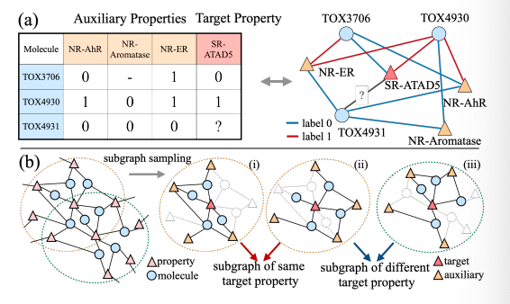
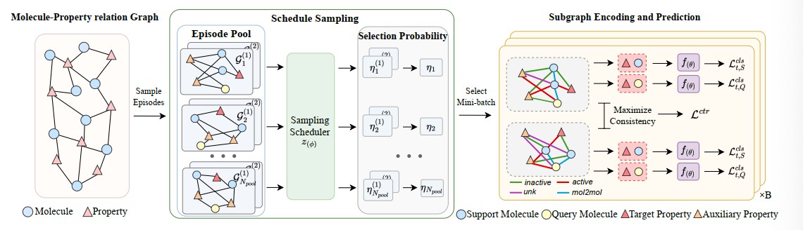
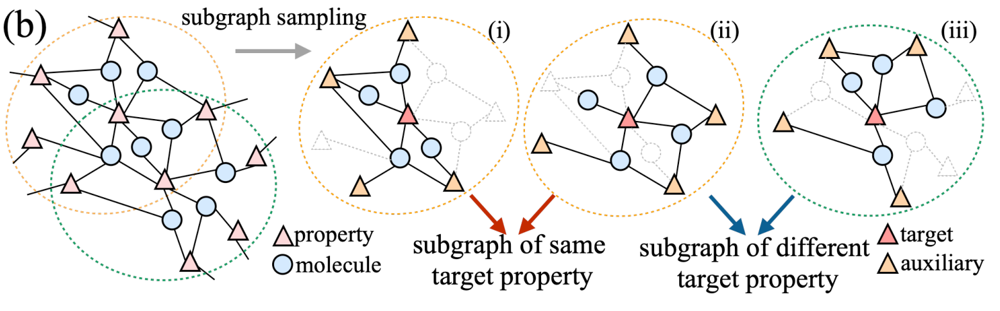
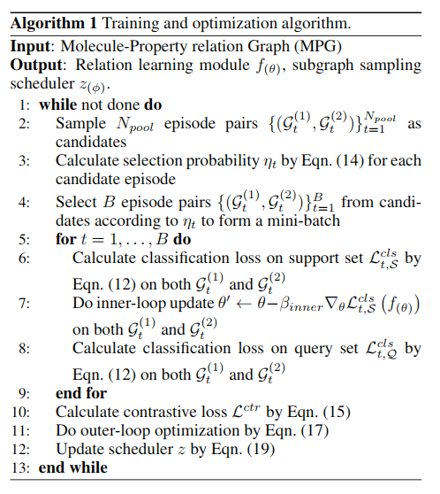
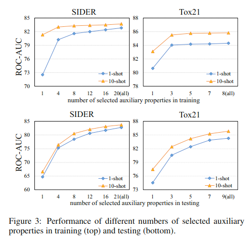
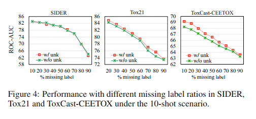
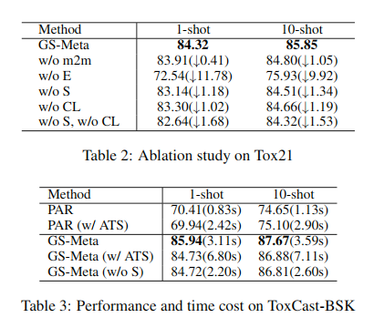
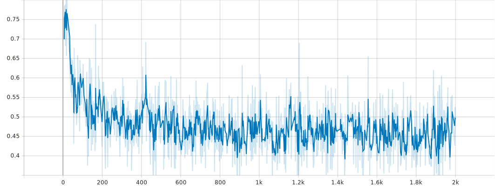
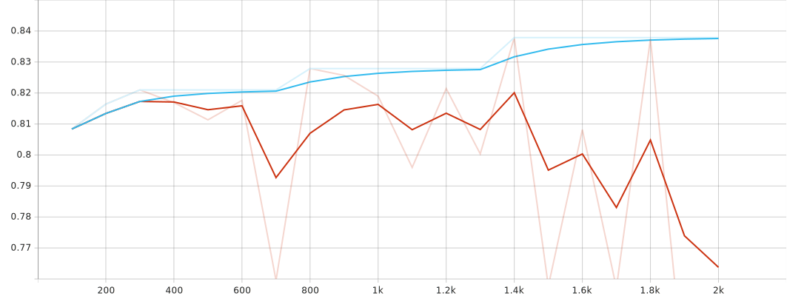

# GS-meta

## 前置

MAML，GNN

## Abstract

预测分子性质基于有限数据，普遍被视为小样本

但是分子性质与分子关联是多对多，所以需要给予图采样，本文包含三个核心步骤

- 构建分子性质关系图（MPG）
- 基于 MPG 重新定义元学习中的任务
- 使用对比损失调度图采样过程

## Introduction

**有一篇 Meta-GNN 的论文**，Meta-GNN [Guo et al., 2021]

总而言之，是一个在分子性质上应用元学习和图采样的方法工程



## Related Work

- Few-shot Learning for Molecules
- Episode Scheduler in Meta-learning

## Graph Sampling-based Meta-Learning

给出了元学习结构如图



手动构建 MPG，然后进行随机采样，构建任务片段池，用子图采样器计算选择概率，然后选择包含 B 个任务片段的 mini_batch

这里子图是一个数据，一组子图是一个任务，一个 mini_batch 中含有多个任务

### Problem Definition

这里有$\mathcal{D}_{\text{train}} \ \mathcal{D}_{\text{test}}$，包含不同的**任务**

训练性质和测试性质不相交，即测试中需要预测的完全是新的性质

> [!NOTE]
>
> 这里，任务和性质一一对应，模型每次输出的是分子在这个性质上的表现

这里元学习的外层循环使用 mini_batch 进行训练，而内侧循环使用了 Episodic Training（情景训练）

> [!NOTE]
>
> 注意这里的 mini_batch 是对不同任务的划分，和传统的 mini_batch 区别

内层循环，即对于一个单独的任务来说，采样一个训练集$\mathcal{S}_t$和一个测试集$\mathcal{Q}_t$

通常，训练集包含两个类别，分别是活跃与非活跃，每个类别包含 K 个分子，测试集包含 M 个分子

这里情境定义为$E = (\mathcal{S}_t, \mathcal{Q}_t)$

### Molecule-Property Relation Graph

**构建分子-性质关系图**，图表示为$\mathcal{G} = (\mathcal{V}, \mathcal{E})$，表示节点集金和边集的二元组

有两种节点，分别是分子节点$\mathcal{V}_M = \left\{  x_m\right\}$和性质节点$\mathcal{V}_T = \left\{  p_t\right\}$，边集是二者的笛卡尔积$\mathcal{E} = \{e_{ij}\}$，有两种标签**活跃**与**非活跃**

对于一个分子$x_i$，使用一个基于图的编码器获得其嵌入表示

$$
x_i = f_{mol}(x_i)
$$

性质节点的嵌入表示被随机初始化，长度与分子嵌入相同

> [!NOTE]
>
> 这里的嵌入表示为将图表示为向量

节点特征表示为

$$
h_0^i = \begin{cases}
p_t \ \ \text{if} \ i \in \mathcal{V}_T \\
x_i \ \ \text{if} \ i \in \mathcal{V}_M
\end{cases}
$$

数据缺失的边类型使用 unk

这个图很大，所以肯定不可能直接进行预测，所以要采样子图，也就是手动构建任务

对于任务$\mathcal{T}_t$，构建如下情景

$$
\mathcal{S}_{t} \sim \mathcal{G}_{t}^{S}=\left\{\left(x_{i}, e_{i,t},p_{t}\right), y_{i,t}\mid x_{i}\in\mathcal{N}\left(p_{t}\right)\right\}_{i=1}^{2K}
$$

简单讲就是某个性质的相邻节点，这里的$\mathcal{N}(p_t)$表示邻居节点

同样，查询集如下

$$
\mathcal{Q}_t \sim \mathcal{G}_t^Q = \{(x_j, p_t), y_{i,t} | x_j \in \mathcal{N}(P_t)\}
$$

有情景如下

$$
E_t \sim \mathcal{G}_t = \mathcal{G}_t^s \cup  \mathcal{G}_t^Q
$$

这里把两个子图合并，就是整个情景

这里的问题在于，分子和性质的关系被局限于多对一，但是实际通常是多对多关系

在预测同一种分子的新性质时，可以利用其他可用性质，所以需要描述这种多对多关系

$$
\mathcal{G}_t^A = \{ (x_i, e_{i,a}, p_a), y_{i,a} | p_a \in \mathcal{N}(x_i) \textbackslash p_t \}
$$

$$
\mathcal{G}_t = \mathcal{G}_t \cup \mathcal{G}_t^A
$$

> [!NOTE]
>
> 为什么要合并训练集和测试集的子图？
>
> 因为需要通过图结构（边的关系等）来进行预测，这也解释为什么测试集没有边：只能通过已知节点的关系来推断未知节点性质

使用**消息传递机制**对采样子图进行迭代更新，这里不仅考虑分子和性质节点之间的关系，分子与分子间也有关系

$$
\alpha^l_{i,j} = \sigma (\text{MLP}(\exp(- | h_i^{l-1} - h^{l-1}_j | )))
$$

这里最外层时 sigmoid 函数，最内部时上一次迭代时两个分子的嵌入表示，结果是两个分子估计出来的连接权重，这个边的类型为*mol2mol*

首先得跑一遍这个把完整的子图嵌入表示弄好，现在一共有四种边的类型了

然后就可以开始跑 GNN 了，这是内层循环的流程，当前讨论的都是针对某一个任务$\mathcal{T}_t$的

根据以下公式更新节点嵌入

$$
h_i^l = \text{GNN}^{l-1}(h_i^{l-1}, h_j^{l-1}, h_{i,j}^{l-1}, w_{i,j}^l | j \in \mathcal{N}(i))
$$

当更新节点的边不是分子与分子之间是，权重指定为 1

$$
w_{i,j}^l = \begin{cases}
a_{i,j}^l \ \ \text{if} \ e_{i,j} \in \mathcal{E}_{M,M} \\
1\ \ \text{otherwise}
\end{cases}
$$

经过 L 次迭代之后，拼接所有节点的最终嵌入，来预测标签

$$
\hat{y}_{i,t} = \sigma\left(f_{cls}\left(\left[\boldsymbol{h}_{i}^{L} \oplus \boldsymbol{h}_{t}^{L}\right]\right)\right)
$$

<a id="12">损失计算公式为</a>

$$
\mathcal{L}_{t,s}^{cls}(f_{(\theta)}) = - \sum_{S_t}(y\log\hat{y} + (1-y) \log (1-\hat{y}))
$$

### Subgrapha Sampling Scheduler

子图采样调度器，之前的相关研究中，mini_batch 用随机均匀概率采样 epsiode，这里设计一个更加合理的调度策略，因为不同任务之间是存在依赖关系的

上面的 MPG 是构建子图的方法，在采样时按需构造子图

- 每个子图仅包含少量分子（设定了是 K 个（训练集，所以对于同一个性质能划分不同的子图，统一性质目标节点的子图应该相关
- 不同目标性质节点为中心的子图差异应该被放大



记子图采样调度器为$z(\phi)$，使用成对（pairwise）采样策略。对于相同的性质目标$p_t$，两张子图$\mathcal{G}_1 \ \mathcal{G}_2$会被同时采样

具体是，在一个 mini*batch 开始的时候，随机采样一个子图候选池$P = \left\{(\mathcal{G}\_t^{(1)}, \mathcal{G}\_t^{(2)})\right\}*{t=1}^{N{\text{pool}}}$

所有二元组中的子图都是围绕同一个性质节点的，调度器$\mathcal{z}_t$通过一下两个步骤选择出唯一的二元组

计算子图嵌入$\mathcal{g}_t$

$$
\mathcal{g}_t = \mathbf{h}_t^{L} + \sigma\left(\sum_{i \in \mathcal{V} \setminus {p_t}} \mathbf{h}_i^{L}\right)
$$

这里$\mathbf{h}_t^L$是$p_t$的最终嵌入，求和那一坨是指对子图中除了目标性质节点以为其他所有节点最终嵌入的池化（这里就是求和），这里$\sigma$未作解释，应该是个非线性函数

然后，把$g_t$输入调度器$z_t$，得到选择概率$\eta_t$

$$
\eta_t = z_1\left(g_t + z_2 \left( \sum_{t' \in P \setminus \mathcal{G}_t} g_{t'}\right)\right)
$$

这里的$z$都是 MLP（全连接网络），一同构成最终的调度器$z(\phi)$，然后对$\eta_t$用 softmax 就能得到合理的概率了

> [!NOTE]
>
> 这里的表述没有问题，一个任务有多个子图，最终是多个数值应用 softmax

对于候选池的每一个子图对，用走一套流程，然后最子图对的概率就是二者平均，最终 B 个子图对构成一个 mini_batch

分子类别之间的区别，用到 NT-Xen 损失，这个在对比学习中被广泛使用。统一性质的子图就是正样本对，不同性质的是负样本。一个 mini_batch 中对比损失定义如下

$$
\mathcal{L}^{\mathrm{ctr}} =\frac{1}{B}\sum_{t=1}^{B} -\log \frac{\exp\big(\mathrm{sim}({g}_t^{(1)},{g}_t^{(2)})/\tau\big)} {\sum_{t'=1,,t'\neq t}^{B}\exp\big(\mathrm{sim}({g}_t^{(1)},{g}_{t'}^{(2)})/\tau\big)}
$$

这个主要是训练调度器的，但是最终也会影响 GNN 的迭代

sim 啥啥啥是余弦相似度，$\tau$为温度系数

总结一下，上面讲了元学习的任务定义，基于 GNN 的 MPG，然后有 MLP 模块的子图采样器

## Training and Testing

终于要开始训练模型了

首先对于性质$t=1$，从候选池拿出 B 个任务对(一个 mini*batch)$\left\{\left(\mathcal{G}\_1^{(1)}, \mathcal{G}\_t^{(2)}\right)\right\}*{t=1}^B$

这里注意了，内层 GNN 使用的任务仍然是一个子图，这里的任务对是用来做对比损失的

关注内层循环(inner-loop)，根据<a href="#12">公式 12</a>计算支持集损失，然后做一次<a id="16">梯度下降</a>

$$
\theta' \leftarrow \theta - \beta_{inner}\nabla_\theta \mathcal{L}^{cls}_{t,S}\left(f(\theta)\right)
$$

这里$\beta$是内循环的学习率，更新完参数之后，再在查询集上计算损失，记为$\mathcal{L}_{t,\mathcal{Q}}^{cls}$，这个在外层循环有用

外层循环公式为

$$
\theta \leftarrow \theta \beta_{outer}\nabla_\theta \mathcal{L}\left( f(\theta')\right)
$$

这里的损失函数定义为

$$
\mathcal{L}\left(f(\theta')\right)= \frac1{2B}\sum^B_{t=1} \left({\mathcal{L}^{cls}_{t, \mathcal{Q}}}^{(1)} + {\mathcal{L}^{cls}_{t, \mathcal{Q}}}^{(2)}  \right) + \lambda \mathcal{L}^{ctr}
$$

$\lambda$是一个超参数，这里实际上就是将任务之间的关系量化为一个对比损失函数，然后添加到外循环里

看形式化伪代码



这里还有一个基于 MLP 的采样器需要训练，但是这玩意不好直接求导，所以使用策略梯度方法来训练调度器

$$
\phi \leftarrow \phi + \gamma\nabla_\phi \log P(\eta)(R - b)
$$

> 这里的 P 是什么东西，R 是什么

测试的时候选一个新性质，然后用辅助性质+内层循环<a href="#16">公式 16</a>微调即可

## Expriments

- GS-Meta 是否优于最先进的基线方法
- 辅助性质(auxiliary properties)效果如何
- episode 和采样调度器有没有用
- 调度器怎么解释（$z(\phi)$）

文章跑了下列模型

- 从头学习分子编码器的方法 Siamese，ProtoNet，MAML，TPN，EGNN，InterReLSTM，PAR，本文模型 GS-Meta
- 预训练分子编码器的防范 Pre-GNN，Meta-MGNN，Pre-PAR，本文模型 Pre-GS-Meta

不同种子下重复 10 次，看均值和标准差

### RQ1

模型在所有基线上均有提升，其中给予关系图的方法普遍更好，表明在本文在跑 GNN 的时候考虑分子间关系是有效的

不同数据集效果有差异，可能取决于辅助性质的多少，标签完整度

### RQ2

改变训练阶段和测试阶段采样的辅助性质的个数来进行测试，结果如图



同时测试辅助性质缺失标签造成的影响，和增加标签 unk 的影响



## RQ3

也就是相关分子，这里测了移除 mol2mol 边的情况 w/o m2m

采样调度器

- w/o S，随机 mini_batch，不调度
- w/o CL，调度，会影响 GNN 迭代，但是外层循环不使用损失
- w/o S, w/o CL，都不用



表现好，耗时短

## RQ4

可视化性质关系


性质越相似，越容易出现在同一个 mini_batch 中

## 复现

在 sider 数据集上跑了一个 10-shot，没有预训练编码器的 GS-Meta

params 如下

```
{
    "exp_name": "run",
    "dump_path": "dump/",
    "exp_id": "19-04-52.941",
    "gpu": "0",
    "random_seed": 0,
    "data_root": "data",
    "dataset": "sider",
    "mol_num_layer": 5,
    "emb_dim": 300,
    "JK": "last",
    "mol_dropout": 0.1,
    "mol_graph_pooling": "mean",
    "mol_gnn_type": "gin",
    "mol_batch_norm": 1,
    "mol_pretrain_load_path": null,
    "rel_layer": 2,
    "rel_edge_n_layer": 2,
    "rel_top_k": 9,
    "rel_edge_hidden_dim": 100,
    "rel_dropout": 0.1,
    "rel_pre_dropout": 0.1,
    "rel_nan_w": 1.0,
    "rel_nan_type": "nan",
    "rel_batch_norm": 1,
    "rel_edge_type": 1,
    "inner_lr": 0.5,
    "meta_lr": 0.001,
    "weight_decay": 5e-05,
    "second_order": 1,
    "inner_update_step": 1,
    "inner_tasks": 10,
    "episode": 2000,
    "n_support": 10,
    "n_query": 16,
    "n_test_tasks": 200,
    "eval_step": 100,
    "test_batch_size": 128,
    "train_auxi_task_num": null,
    "test_auxi_task_num": null,
    "nce_t": 0.08,
    "contr_w": 0.05,
    "pool_num": 10,
    "task_lr": 0.0005,
    "task_hid_dim": 10,
    "task_t": 1
}
```

模型描述如下

```
GSMeta(
  (mol_encoder): GNN_Encoder(
    (gnn): GNN(
      (x_embedding1): Embedding(120, 300)
      (x_embedding2): Embedding(3, 300)
      (gnns): ModuleList(
        (0): GINConv(
          (mlp): Sequential(
            (0): Linear(in_features=300, out_features=600, bias=True)
            (1): ReLU()
            (2): Linear(in_features=600, out_features=300, bias=True)
          )
          (edge_embedding1): Embedding(6, 300)
          (edge_embedding2): Embedding(3, 300)
        )
        (1): GINConv(
          (mlp): Sequential(
            (0): Linear(in_features=300, out_features=600, bias=True)
            (1): ReLU()
            (2): Linear(in_features=600, out_features=300, bias=True)
          )
          (edge_embedding1): Embedding(6, 300)
          (edge_embedding2): Embedding(3, 300)
        )
        (2): GINConv(
          (mlp): Sequential(
            (0): Linear(in_features=300, out_features=600, bias=True)
            (1): ReLU()
            (2): Linear(in_features=600, out_features=300, bias=True)
          )
          (edge_embedding1): Embedding(6, 300)
          (edge_embedding2): Embedding(3, 300)
        )
        (3): GINConv(
          (mlp): Sequential(
            (0): Linear(in_features=300, out_features=600, bias=True)
            (1): ReLU()
            (2): Linear(in_features=600, out_features=300, bias=True)
          )
          (edge_embedding1): Embedding(6, 300)
          (edge_embedding2): Embedding(3, 300)
        )
        (4): GINConv(
          (mlp): Sequential(
            (0): Linear(in_features=300, out_features=600, bias=True)
            (1): ReLU()
            (2): Linear(in_features=600, out_features=300, bias=True)
          )
          (edge_embedding1): Embedding(6, 300)
          (edge_embedding2): Embedding(3, 300)
        )
      )
      (batch_norms): ModuleList(
        (0): BatchNorm1d(300, eps=1e-05, momentum=0.1, affine=True, track_running_stats=True)
        (1): BatchNorm1d(300, eps=1e-05, momentum=0.1, affine=True, track_running_stats=True)
        (2): BatchNorm1d(300, eps=1e-05, momentum=0.1, affine=True, track_running_stats=True)
        (3): BatchNorm1d(300, eps=1e-05, momentum=0.1, affine=True, track_running_stats=True)
        (4): BatchNorm1d(300, eps=1e-05, momentum=0.1, affine=True, track_running_stats=True)
      )
    )
  )
  (relation_net): TaskRelationNet(
    (pre_dropout): Dropout(p=0.1, inplace=False)
    (task_emb): Embedding(27, 300)
    (node_layer0): NodeUpdateNetwork(
      (neigh_linear): Linear(in_features=300, out_features=300, bias=True)
      (root_linear): Linear(in_features=300, out_features=300, bias=True)
      (edge_emb): Embedding(4, 300)
      (batch_norm): BatchNorm1d(300, eps=1e-05, momentum=0.1, affine=True, track_running_stats=True)
      (dropout): Dropout(p=0.1, inplace=False)
      (act): LeakyReLU(negative_slope=0.01)
    )
    (edge_layer0): EdgeUpdateNetwork(
      (sim_network): Sequential(
        (conv0): Conv2d(300, 200, kernel_size=(1, 1), stride=(1, 1), bias=False)
        (norm0): BatchNorm2d(200, eps=1e-05, momentum=0.1, affine=True, track_running_stats=True)
        (relu0): LeakyReLU(negative_slope=0.01)
        (drop0): Dropout2d(p=0.1, inplace=False)
        (conv1): Conv2d(200, 100, kernel_size=(1, 1), stride=(1, 1), bias=False)
        (norm1): BatchNorm2d(100, eps=1e-05, momentum=0.1, affine=True, track_running_stats=True)
        (relu1): LeakyReLU(negative_slope=0.01)
        (drop1): Dropout2d(p=0.1, inplace=False)
        (conv_out): Conv2d(100, 1, kernel_size=(1, 1), stride=(1, 1))
      )
    )
    (node_layer1): NodeUpdateNetwork(
      (neigh_linear): Linear(in_features=300, out_features=300, bias=True)
      (root_linear): Linear(in_features=300, out_features=300, bias=True)
      (edge_emb): Embedding(4, 300)
      (batch_norm): BatchNorm1d(300, eps=1e-05, momentum=0.1, affine=True, track_running_stats=True)
      (dropout): Dropout(p=0.1, inplace=False)
      (act): LeakyReLU(negative_slope=0.01)
    )
    (edge_layer1): EdgeUpdateNetwork(
      (sim_network): Sequential(
        (conv0): Conv2d(300, 200, kernel_size=(1, 1), stride=(1, 1), bias=False)
        (norm0): BatchNorm2d(200, eps=1e-05, momentum=0.1, affine=True, track_running_stats=True)
        (relu0): LeakyReLU(negative_slope=0.01)
        (drop0): Dropout2d(p=0.1, inplace=False)
        (conv1): Conv2d(200, 100, kernel_size=(1, 1), stride=(1, 1), bias=False)
        (norm1): BatchNorm2d(100, eps=1e-05, momentum=0.1, affine=True, track_running_stats=True)
        (relu1): LeakyReLU(negative_slope=0.01)
        (drop1): Dropout2d(p=0.1, inplace=False)
        (conv_out): Conv2d(100, 1, kernel_size=(1, 1), stride=(1, 1))
      )
    )
    (graph_pooling): Sequential(
      (0): Linear(in_features=300, out_features=150, bias=True)
      (1): ReLU()
      (2): Linear(in_features=150, out_features=300, bias=True)
    )
    (classifier): Sequential(
      (0): Linear(in_features=600, out_features=300, bias=True)
      (1): BatchNorm1d(300, eps=1e-05, momentum=0.1, affine=True, track_running_stats=True)
      (2): ReLU()
      (3): Linear(in_features=300, out_features=1, bias=True)
    )
  )
)
```

子图调度器结构如下

```
TaskSelector(
  (z1): Sequential(
    (0): Linear(in_features=300, out_features=10, bias=True)
    (1): ReLU()
    (2): Linear(in_features=10, out_features=1, bias=True)
    (3): Tanh()
  )
  (z2): Sequential(
    (0): Linear(in_features=300, out_features=300, bias=True)
    (1): ReLU()
    (2): Linear(in_features=300, out_features=300, bias=True)
  )
)
```

训练 loss，测试得分如下图





最终得分 83.75，与论文基本一致
