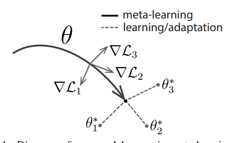
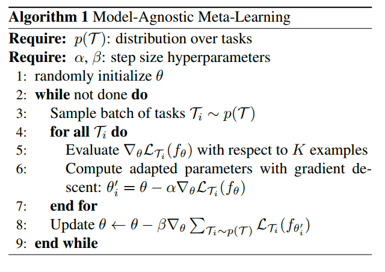

# Model-Agnostic Meta-Learning for Fast Adaptation of Deep Networks

## Abstract

**模型无关**的元学习（meta-learning） 算法，兼容所有基于**梯度下降**训练的模型，适用于分类、回归和强化学习

通过对模型进行多任务训练（a variety of learning tasks），用少量训练样本解决新任务？

使用少量数据和训练就能在任务上得到很好的泛化性能

简单来说，MAML 赋予模型学习“如何学习”的能力，是的其在面对新任务时能够快速适应

## Intro

**算法核心：训练模型的初始参数，是的模型在之后遇到新的任务时，通过少量数据就能获得最大性能**

与先前提出的元学习算法不同，此算法不增加学习参数数量，不约束模型架构

从特征学习的角度，MAML 算法过程，可以被视为构建了一种广泛使用于多种模型的内部表征（Internal representation）

从动力系统角度，这个学习过程可以被视为最大化新任务损失函数**对参数的敏感性**，只要敏感度够高，参数的微小变化就能使任务损失大幅提升

本文评估结果：监督分类任务中，MAML 优于专门为小样本学习的最先进方法（17 年），在回归问题和强化学习中，性能远超直接使用预训练模型进行初始化的传统方法

> [!NOTE]
>
> 这里的**显著优于**适用于**存在任务变异性**的场景中**强化学习**进程的预训练初始化，对于普通的回归问题，原文为（can also be readily applied to）

## Model-Agnostic Meta-Learning

这玩意通常在小样本学习的理论框架下

### Meta-Learning Problem Set-Up

考虑一个模型$f$，将观测$x$映射到$a$，因为框架是通用的，所以需要通用任务概念

$$
\mathcal{T} = \left\{ \mathcal{L}(\mathbf{x}_1, \mathbf{a}_1, \ldots, \mathbf{x}_H, \mathbf{a}_H),\ q(\mathbf{x}_1),\ q(\mathbf{x}_{t+1} \mid \mathbf{x}_t, \mathbf{a}_t),\ H \right\}
$$

其中，包含一个损失函数$\mathcal{L}$，初始观测分布$q(\mathbf{x}_1)$，转移分布$q(\mathbf{x}_{t+1} \mid \mathbf{x}_t, \mathbf{a}_t)$，和情节长度$H$

独立同分布问题中，长度$H = 1$，模型在每个时间步选择一个$a$来生成长度为$H$的样本，损失函数提供任务特定的反馈

在元学习场景中，考虑一个**任务分布**$p(\mathcal{T})$，模型需要尽快适应这个新的分布

### A Model-Agnostic Meta-Learning Algorithm

模型在新任务上使用基于梯度的规则进行微调，我们使用同样的方式学习一个模型，目标是找到**对任务变化敏感的模型参数**

**这里的参数指的是内部参数，而不是超参数**

有一下两个假设

- 模型由$\theta$参数化
- 损失函数足够平滑

这里的损失通过任务的$\mathcal{L}$来计算，而$\theta$指代模型的内部参数，通过梯度下降更新

$$
\theta'_i = \theta - \alpha \nabla_{\theta}\mathcal{L}_{\mathcal{T}_i}(f_{\theta})
$$

本节考虑一次梯度更新的情况，多次也行，反正就是计算单个任务的较优内部参数

训练方式就是优化其在不同任务上对应的性能，即最小化代价函数

$$
\min_{\theta} \sum_{\mathcal{T}_i \sim p(\mathcal{T})} \mathcal{L}_{\mathcal{T}_i} (f_{\theta_i'}) = \sum_{\mathcal{T}_i \sim p(\mathcal{T})} \mathcal{L}_{\mathcal{T}_i} (f_{\theta - \alpha \nabla_\theta \mathcal{L}_{\mathcal{T}_i}(f_\theta)})
$$

通过随机梯度下降（SGD）执行优化迭代如下

$$
\theta \leftarrow \theta - \beta \nabla_{\theta} \sum_{\mathcal{T}_{i} \sim p(\mathcal{T})} \mathcal{L}_{\mathcal{T}_{i}}(f_{\theta_{i}^{\prime}})
$$

有形式化算法

对于单个损失的计算，使用了验证集和训练集

这里的梯度更新实际上涉及梯度的梯度，所以需要进行一次额外的反向传播，大多数库都支持

也有一种省略该传播的近似

---

实际应用和实现先不看了
