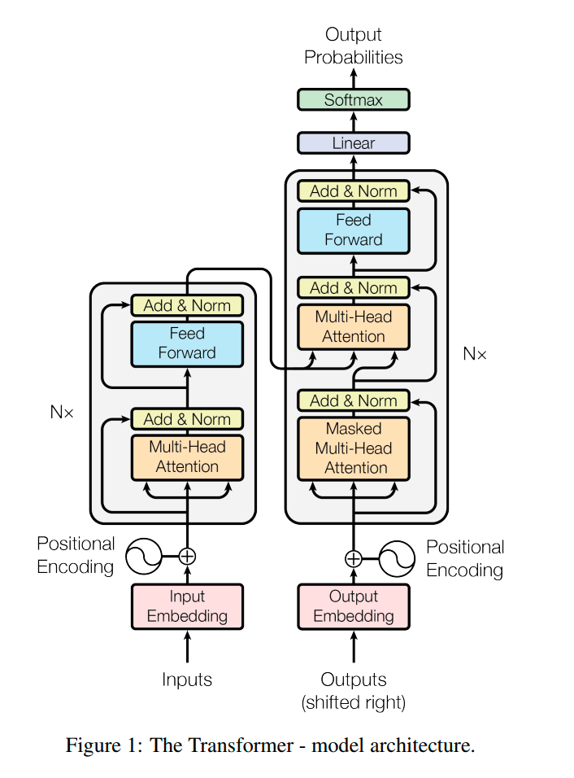
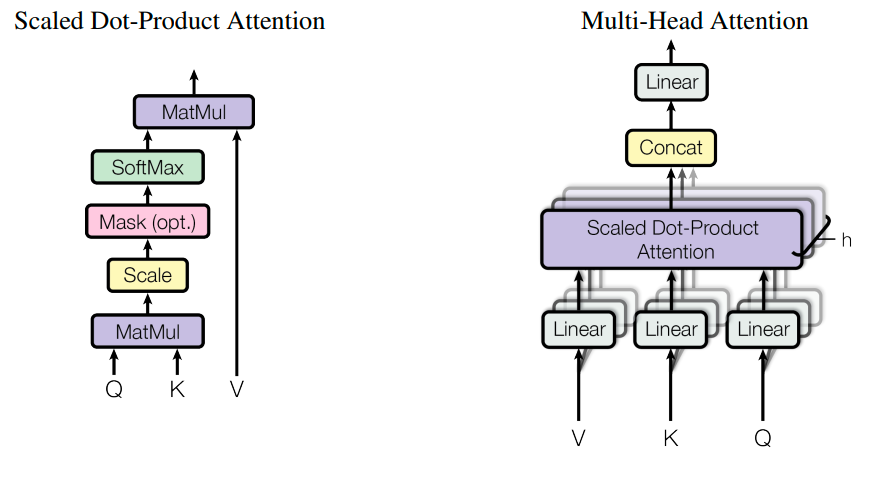
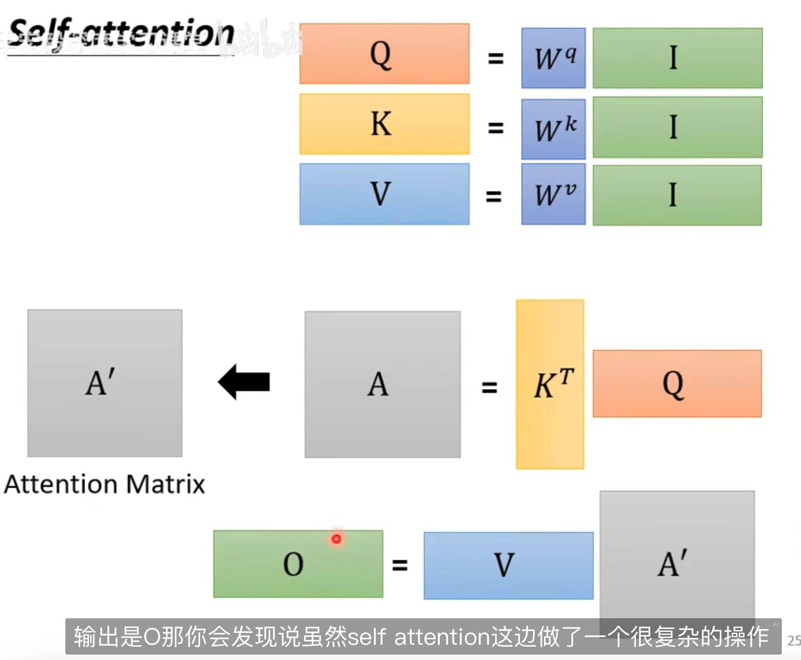
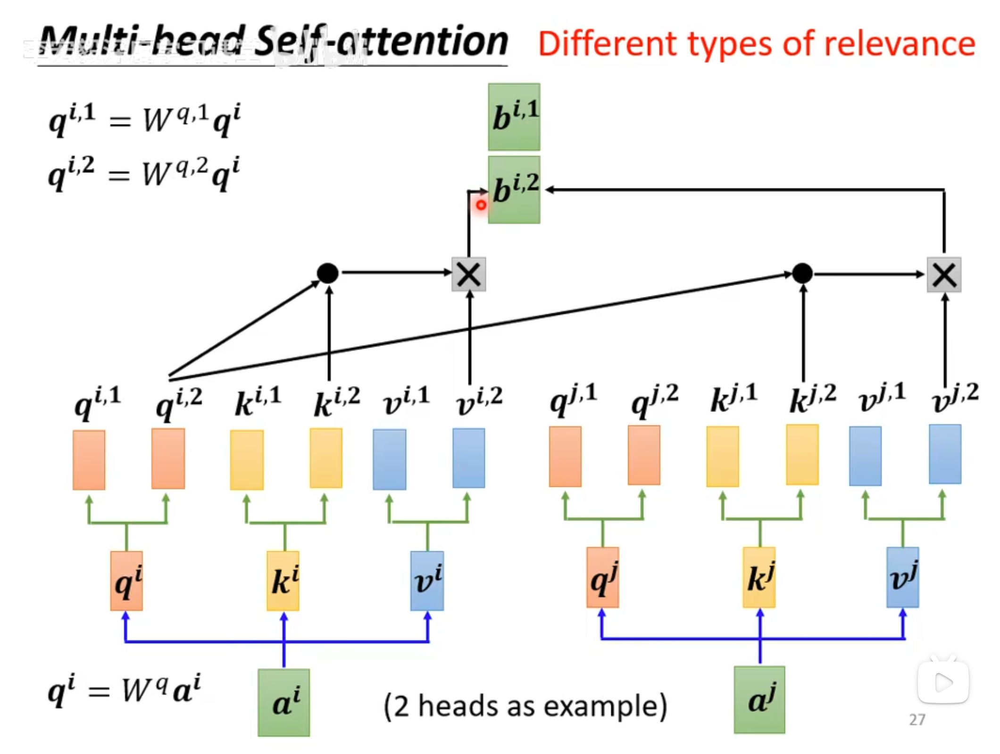

# Transformer

## Abstract

主流 Seq2Seq 模型，基于 CNN 和 RNN，包含 encoder 和 decoder 的复杂模型，通过注意力机制连接解码器和编码器

Transformer，摆脱 CNN 与 RNN，仅使用注意力机制

好训练，精度高，可泛化

## Intro

当前状态依赖于上一次计算得到的状态，因此每个 token 无法进行并行计算，限制模型性能

Transformer 结构避免循环，通过 Self-attention 让序列中的每一个 token 都与其他所有 token 直接建立联系

模型第一层直接接收到的输入时序列中所有 token 嵌入向量（Embedding Vectors 和 位置编码（Positional encoding 组成的矩阵

平均注意力加权可能导致有效分辨率降低，但是可以通过 Multi-Head 抵消这种负面影响

> 每个特征因为混入了上下文联系信息，导致其本身的细节特征在一定程度上被模糊

recurrent attention instead of sequence-aligned recurrence

前者是 transformer 采用的，计算注意力矩阵的方式，后者是 RNN 使用的，步进迭代当前状态的

## Model Architecture



### Encoder and Decoder

Encoder 包含 6 个完全相同的层，每层有一个 Multi-Head Attention 和前馈全连接，两个子层都做了**残差连接和归一化(Add and Norm)**

> 这个 Add & Norm 有点神秘

这里的 FFN，类似针对矩阵的全连接计算（这里因为上下文相关，所以不会混合位置信息

Decoder 同样由三个子层组成，这里每层第一个 self-attention 加上了掩码，这个需要结合预测和训练的不同行为来理解

- 训练时，给 Decoder 的输入时正确答案，为了不让模型知道后续的正确答案（因为预测时不知道），需要掩码进行修饰
- 训练时，Decoder 的输入时自回归的输出，每一次输出的内容时与之前的输出有联系

### Attention



query，key，value 三个向量，映射成一个 output。output 是通过对 value 加权求和算出来的。权重时通过 query 和 key，用 compatibility function 算出来的

> 这里的 cpmatibility function 就是 Scaled Dot-Product Attention 算法

> [!NOTE]
>
> 这里的三个向量是原来的输入点乘了神秘参数
>
> 

#### Scaled Dot-Product Attention

实际上就是

$$
Attention(Q,K,V) = softmax(\frac{QK^T}{\sqrt{d_k}})V
$$

Q 和 K 的转置点乘，得到 Q 和 K 的相关性值，除以纬度放缩，然后 softmax 输出一个权重矩阵，拿这个矩阵和 V 相乘，得到 V 得加权平均

> 这个加权平均矩阵，每一个向量都融合了输入矩阵的特征

> [!NOTE]
>
> 论文中的模型 self-attention 计算相关性的方式是 Dot-product，但是也可以使用矩阵和的形式 Additive，论文中提到这种形式可能在不进行缩放的情况下优于 Dot-product，所以这里会使用$\sqrt{d_k}$进行缩放
>
> 实际上 QK 两个向量都是用来计算 self-attention 中相关性引出的，其点积结果就是 Dot-product 的结果
>
> 这个结果表明了输入矩阵中的向量两两之间关系的权重，这里再乘以 V 向量就相当于求加权和，得到的结果就是矩阵中某个向量与其他矩阵的关系分数

#### Multi-Head Attention



就是通过不同的参数得出不同版本的 QKV，然后分别计算相关性得分

注意每个版本的 QKV 得到的都是一个向量，将这些向量拼接成一个矩阵，然后与可学习参数$W^o$点乘，得到最终 Multi-Head Attention 的计算结果

## FFN

两个线性全连接，中间夹着一个 ReLU

FFN（前馈层，又叫 MPL（多层感知 🐔

## Train

优化器使用 Adam

## Code

```python
import torch.nn as nn

# 使用 Transformer base 参数
d_model = 512      # 嵌入维度
N = 6              # 编码器和解码器的层数
h = 8              # 多头注意力的头数
d_ff = 2048        # 前馈神经网络的隐藏层维度
dropout = 0.1      # Dropout 概率

model = nn.Transformer(
    d_model=d_model,
    nhead=h,
    num_encoder_layers=N,
    num_decoder_layers=N,
    dim_feedforward=d_ff,
    dropout=dropout,
    batch_first=True
)

print(model)
```

```
Transformer(
  (encoder): TransformerEncoder(
    (layers): ModuleList(
      (0-5): 6 x TransformerEncoderLayer(
        (self_attn): MultiheadAttention(
          (out_proj): NonDynamicallyQuantizableLinear(in_features=512, out_features=512, bias=True)
        )
        (linear1): Linear(in_features=512, out_features=2048, bias=True)
        (dropout): Dropout(p=0.1, inplace=False)
        (linear2): Linear(in_features=2048, out_features=512, bias=True)
        (norm1): LayerNorm((512,), eps=1e-05, elementwise_affine=True)
        (norm2): LayerNorm((512,), eps=1e-05, elementwise_affine=True)
        (dropout1): Dropout(p=0.1, inplace=False)
        (dropout2): Dropout(p=0.1, inplace=False)
      )
    )
    (norm): LayerNorm((512,), eps=1e-05, elementwise_affine=True)
  )
  (decoder): TransformerDecoder(
    (layers): ModuleList(
      (0-5): 6 x TransformerDecoderLayer(
        (self_attn): MultiheadAttention(
          (out_proj): NonDynamicallyQuantizableLinear(in_features=512, out_features=512, bias=True)
        )
        (multihead_attn): MultiheadAttention(
          (out_proj): NonDynamicallyQuantizableLinear(in_features=512, out_features=512, bias=True)
        )
        (linear1): Linear(in_features=512, out_features=2048, bias=True)
        (dropout): Dropout(p=0.1, inplace=False)
        (linear2): Linear(in_features=2048, out_features=512, bias=True)
        (norm1): LayerNorm((512,), eps=1e-05, elementwise_affine=True)
        (norm2): LayerNorm((512,), eps=1e-05, elementwise_affine=True)
        (norm3): LayerNorm((512,), eps=1e-05, elementwise_affine=True)
        (dropout1): Dropout(p=0.1, inplace=False)
        (dropout2): Dropout(p=0.1, inplace=False)
        (dropout3): Dropout(p=0.1, inplace=False)
      )
    )
    (norm): LayerNorm((512,), eps=1e-05, elementwise_affine=True)
  )
)
```
